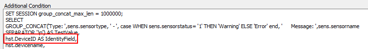

## Summary

This script is a complete ticket creation script only to be used with the ESXi Bad Sensor Monitor.

## Monitor Driven Only

This script is designed to be monitor driven only and should never be manually run. If it is manually run, the script will simply exit on the first step in the else section.

## Dependencies

This script's only dependency is that the monitor that is triggering the script has the network deviceID reporting in as the fieldname. The script will gather all other information it needs.

## Process

1. Gather information based on the network deviceID that the monitor has reported.
2. Create a ticket for ESXi Bad sensors, listing them all out accordingly.

## Example Ticket

> The ESXi Host named \<ESXI HostName> at \<Client>/\<Location> is currently reporting 4 Bad Sensors  
>  
> The ESXi Host information is outlined below:  
> Host Name: \<computername>  
> ESXi Version: VMware ESXi 6.7.0  
> Host Make/Model: HPE ProLiant DL380 Gen10  
> S/N OF Host: \<Serial Number of Host>  
>  
> There is 1 reported VM running on this host. It has been displayed below:  
> \<VM Name>  
>  
> The Failing sensors have been listed below:  
> Type: Storage - Error      Message: Disk 1 on HPSA1 : Port  Box 0 Bay 0 : 0GB : Unconfigured Disk : Disk Error  
> Type: Storage - Error      Message: Disk 2 on HPSA1 : Port  Box 0 Bay 0 : 0GB : Unconfigured Disk : Disk Error  
> Type: Storage - Error      Message: Disk 3 on HPSA1 : Port  Box 0 Bay 0 : 0GB : Unconfigured Disk : Disk Error  
> Type: Storage - Error      Message: Disk 4 on HPSA1 : Port  Box 0 Bay 0 : 0GB : Unconfigured Disk : Disk Error  

