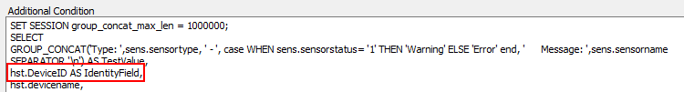

## Summary

This script is a complete ticket creation script only to be used with the ProVal - Production - ESXi Storage Space < 10% Monitor.

## Monitor Driven Only

This script is designed to be monitor driven only and should never be manually run. If it is manually run, the script will simply exit on the first step in the else section.

## Dependencies

This script's only dependency is that the monitor that is triggering the script has the network deviceID reporting in as the fieldname. The script will gather all other information it needs.

## Process

1. Gather information based on the network deviceID that the monitor has reported.
2. Create a ticket for ESXi low storage space, listing them all out accordingly.

## Example Ticket

> The ESXi Host named @ESXHostName@ at %CLIENTNAME%/%LocationName% is reporting low disk space.  
>  
> The ESXi Host information is outlined below:  
> Host Name: <ESXi Host Name>  
> ESXi Version: VMware ESXi 6.7.0  
> Host Make/Model: HPE ProLiant DL380 Gen10  
> S/N OF Host: <ESXi Serial Number>  
> Last Check-In: 5/31/2022 11:33:54 AM  
> Network Device ID: <Device ID>  
>  
> There is 1 reported VM running on this host. It has been displayed below:  
> <VM Name>  
>  
> <Datastores with low disk space listed here>  

