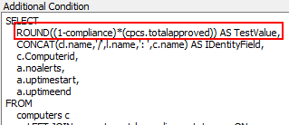

## Summary

This script is a complete ticket creation script only to be used with the ProVal - Production - Patching - Missing 5+ Patches but should be able to work as long as the count of patches is getting returned to the %result% variable.

## Monitor Driven Only

This script is designed to be monitor driven only and should never be manually run. If it is manually run, the script will simply exit on the first step in the else section.

## Dependencies

This script's only dependency is that the monitor that is triggering the script has the count of missing patches reporting in as the result (TestValue). The script will gather all other information it needs.

## Process

1. Gather information based on the network deviceID that the monitor has reported.
2. Create a ticket for machines missing patches, listing them all out accordingly.

## Example Ticket

> There are currently 11 Patches Missing on \<Client Name>/\<Computer Name>.
>
> The PC information is outlined below:  
> PC Name: \<Computer Name>  
> Last Login: \<Last Login>  
> PC model: VMware Virtual Platform  
> OS: Microsoft Windows Server 2012 R2 Datacenter x64  
> S/N OF PC: \<Serial Number>
>
> The missing patches in question are outlined below:
>
> Windows Malicious Software Removal Tool x64 - v5.98 (KB890830)  
> Windows Malicious Software Removal Tool x64 - v5.101 (KB890830)  
> Update for Windows Server 2012 R2 (KB3102429)  
> Update for Windows Server 2012 R2 (KB3084905)  
> Update for Windows Server 2012 R2 (KB3013816)  
> Update for Windows Server 2012 R2 (KB3013769)  
> Security Update for SQL Server 2008 R2 Service Pack 2 (KB3045313)  
> Security Update for Microsoft ASP.NET MVC 3 (KB2993937)  
> Microsoft .NET Framework 4.8 for Windows Server 2012 R2 for x64 (KB4486105)  
> 2022-05 Servicing Stack Update for Windows Server 2012 R2 for x64-based Systems (KB5014025)  
> 2022-05 Security and Quality Rollup for .NET Framework 3.5, 4.6.2, 4.7, 4.7.1, 4.7.2, 4.8 for Windows Server 2012 R2 for x64 (KB5013872)  

