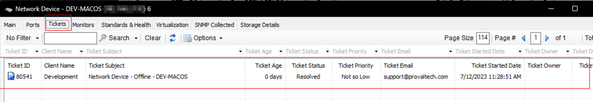
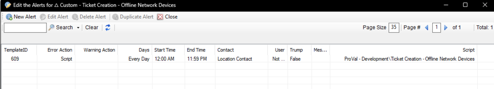
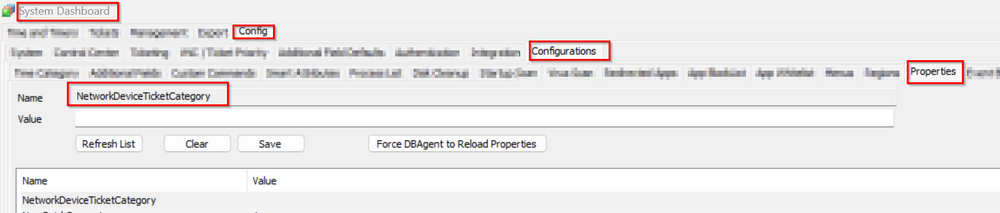
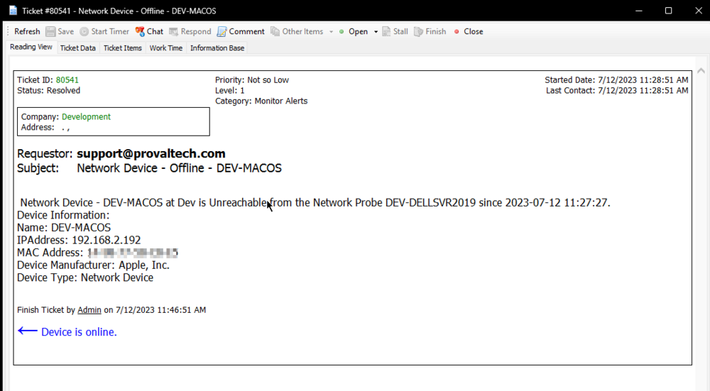

## Summary

The purpose of the script is to create a formatted ticket for an offline or unreachable network device. It will create a ticket for the concerned network device, so for the ticket to sync with CW Manage, the network device should be synced beforehand.



**Note:** Both the script and the monitoring can only be used if the network probe of the device's location is online.

## Sample Run

This is an autofix script for network devices and will not function for manual executions.

The `Send Alert when Unit is Down` checkbox on a network device is required for the script to run from an alert template.




## Dependencies

[CWM - Automate - Script - Network Devices - Offline Ticket Enabling](<./Network Devices - Offline Ticket Enabling.md>)

## Variables

| Name    | Description                                     |
|---------|-------------------------------------------------|
| Status  | Success/Failed/Warning returned by the alert template |
| Message | Alert Message returned by the Network Device     |

## System Properties

| Name                                                                 | Example | Required | Description                                                                                                                                                                                                                     |
|----------------------------------------------------------------------|---------|----------|---------------------------------------------------------------------------------------------------------------------------------------------------------------------------------------------------------------------------------|
| NetworkDeviceTicketCategory                                          | 5       | False    | This will determine the service board where the offline network device ticket should be created.                                                                                                                               |
| ScriptTicketCategory                                                 | 8       | False    | This is a default system property that is set at the CW Manage plugin to create tickets via script to this service board if no ticket category is defined in the script.                                                         |

## Implementation

Refer to the client-script document. This will guide you on how to enable ticketing on manufacturer-based network devices or apply it to all network devices with specific exclusions of the device IDs.  
[Documentation Link](https://proval.itglue.com/5078775/docs/16290414)

## Output

- Script Log
- Ticket

## Ticketing

**Subject:**  `Network Device - Offline - \<Network Device Name>`

**Body:**  
```
Network Device - <Network Device Name> at <Location Name> is Unreachable from the Network Probe <Network Probe Name> since <Last Contact>.
```
**Device Information:**

```
Name: <Network Device Name>
IPAddress: <Network Device IP Address>
MAC Address: <Network Device MAC Address>
Device Manufacturer: <Network Device Manufacturer>
Device Type: <Network Device Type>
```

**Ticket Category:**  
To create this ticket to a specific service board in manage, provide the category ID to the property "NetworkDeviceTicketCategory"; otherwise, it will create the ticket to the default service board.



**Example Ticket:**  


