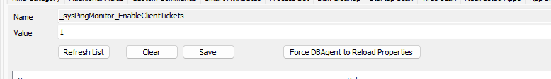
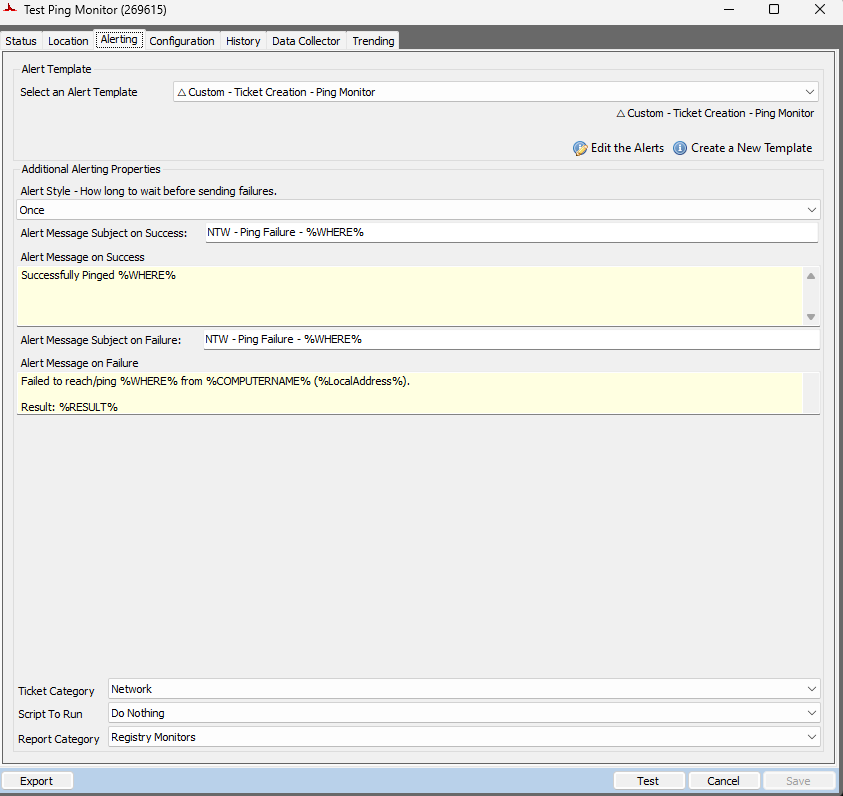
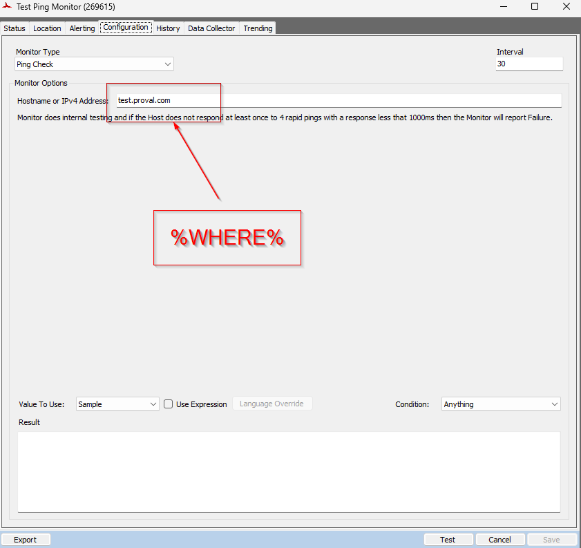
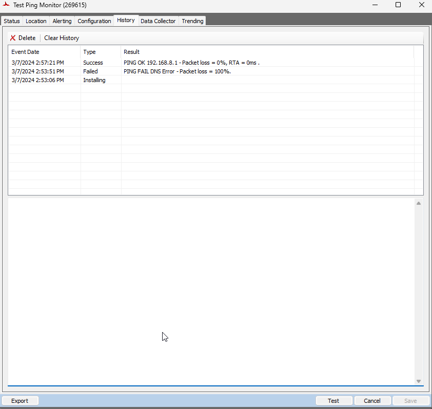
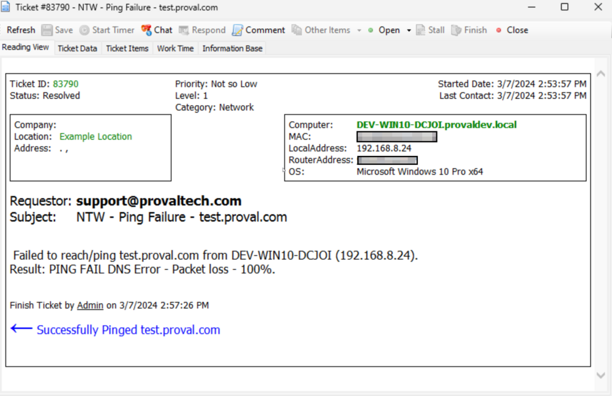

## Summary

This script is a variation of the [Ticket Creation - Computer](<./Ticket Creation - Computer.md>) script, designed specifically for ticket management related to remote ping monitors. The key distinction of this script is that it excludes the addition of the computer's information to the ticket.

The script automatically closes the ticket upon successful ping.

## Sample Run

The script is not intended for manual execution. It is explicitly configured to be executed exclusively from the `△ Custom - Ticket Creation - Ping Monitor` alert template.

## Dependencies

Alert Template: `△ Custom - Ticket Creation - Ping Monitor`

## System Properties

| Name                              | Example | Required | Description                                                                                                                                                                                                                                                                                                                                                                    |
|-----------------------------------|---------|----------|--------------------------------------------------------------------------------------------------------------------------------------------------------------------------------------------------------------------------------------------------------------------------------------------------------------------------------------------------------------------------------|
| _sysPingMonitor_EnableClientTickets | 1       | False    | Set its value to '1' in order to create client tickets under the client corresponding to the IP being pinged in the monitor. The script will match the IP with the router address in the automate and will fetch the corresponding client. If not found, it will create the standard computer tickets on the automate server. By default, its value is '0', which means only standard tickets are enabled.  |

## Sample Ping Monitor

**Status Tab:**  


**Location Tab:**  


**Alerting Tab:**  


**Subject:** `NTW - Ping Failure - %WHERE%`

**Failure Message:**  
```
Failed to reach/ping %WHERE% from %COMPUTERNAME% (%LocalAddress%).

Result: %RESULT%
```

**%WHERE%:** This variable returns the IPv4 Address or Host Name to ping.  
**%RESULT%:** This variable returns the result from the monitor set.  
**%LocalAddress%:** This variable returns the private address of the local computer where the monitor set is executed.

**Configuration Tab:**  


**History Tab:**  


## Sample Ticket

The script will generate the tickets utilizing the subject and message stored in the Alerting tab of the monitor set.  


## Output

- Ticket


