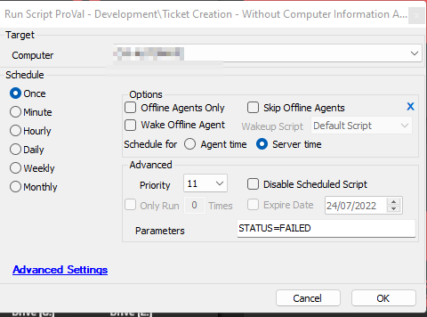

## Summary

This script operates similarly to the [CWM - Automate - Script - Ticket Creation - Computer](https://proval.itglue.com/DOC-5078775-9098338) script; however, instead of creating a ticket with the Computer's Detail, it will create a ticket without including the computer's detail. Also, no actions are defined in the script for the SUCCESS status of the monitors.

## Sample Run

This is an Autofix Script and so far it is being used with the “~Custom Ticket Creation without computer Details” alert template.

## Variables

| Name                    | Description                                                                                              |
|-------------------------|----------------------------------------------------------------------------------------------------------|
| Monitor                 | Name of the monitor set                                                                                  |
| RAWSQL                  | To verify whether if the script was called by a RAWSQL monitor set                                       |
| Dataout                 | Monitor set's Statement, if it's written as a RAWSQL                                                    |
| FIELDNAME               | Monitor set's identity field                                                                              |
| Result                  | Monitor Set's test value                                                                                 |
| TicketSubject           | Subject from the alerting tab of the monitor set                                                         |
| SuccessMSG              | Success Message from the alerting tab of the monitor set                                                |
| FailedMSG               | Failure Message from the alerting tab of the monitor set                                                 |
| TicketCreationCategory   | Ticket Category to assign the ticket                                                                      |
| TicketCreateSubject      | TicketSubject                                                                                             |
| TicketCreateBody         | FailedMSG                                                                                                 |
| TicketComment            | FailedMSG                                                                                                 |
| DataoutLength           | Position of the last parentheses in the Monitor set's query, this is calculated in order to get rid of (select computerid from tcomp) from the monitor set's statement. Keeping this statement will lead to the script's failure. |

## Process

Step 1: Verifies whether if it's a RAWSQL monitor set or a normal internal monitor.  
Step 2: Stores the SQL query used in the monitor set to the `@Dataout@` variable. Also, it replaces the 'from tcomp' with 'from computers', if it exists in the SQL query. In order to perform this replacement, it converts the whole query to lowercase.  
Step 3: Find the `@FieldName@`, [@TicketSubject@,@SuccessMSZ@](http://@TicketSubject@,@SuccessMSZ@), and [@FailedMSZ@.](http://@FailedMSZ@.)  
Step 4: It uses the Automate's default "_System Automation/Functions/Ticket Comment*" script to create a ticket. In order to call that script, `@TicketCreateSubject@`, `@TicketCreateBody@`, and `@TicketComment@` variables have to be defined and they are set with the values of [@TicketSubject@,](http://@TicketSubject@,@SuccessMSZ@) [@FailedMSZ@.](http://@FailedMSZ@.) and [@FailedMSZ@.](http://@FailedMSZ@) variables respectively.  

The script will add a comment if an open ticket for the computer with the same subject already exists. Otherwise, it will create one.

## Output

- Ticket

