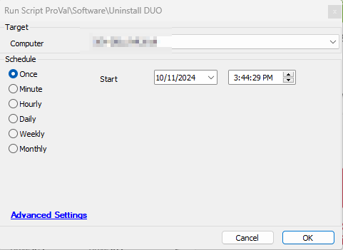

## Summary

This is a version of [SWM - Software Uninstall - Script - Remove Application](https://proval.itglue.com/DOC-5078775-12578871) that is being used to remove DUO specifically.

## Sample Run

## Dependencies

[SWM - Software Uninstall - Agnostic - Remove-Application](<../../powershell/Remove-Application.md>)

#### Global Parameters

| Name                | Example                                 | Mandatory | Description                                                                                                                                                   |
|---------------------|-----------------------------------------|-----------|---------------------------------------------------------------------------------------------------------------------------------------------------------------|
| Name                | Duo Authentication for Windows Logon x64 | True      | The name of the application(s) to remove. Note: No need to update this parameter as it is being used to remove DUO specifically.                           |
| Enable_Ticketing    | 1                                       | False     | Setting this parameter to 1 will enable the ticket creation feature of the script, and the script will create a ticket if it fails to uninstall the application. |

## Output

- Script Logs
- Ticketing

## Ticketing

**Subject:** `DUO Removal - Failed - %COMPUTERNAME%`

**Ticket Body:** `The script attempted to remove DUO from the computer but it failed. In addition to the primary removal script (Remove-Application.ps1), alternative uninstallation methods utilizing uninstall strings stored in Automate were also employed. Despite this, the script failed to remove the application. Manual review is required to identify the cause of the failure.`

