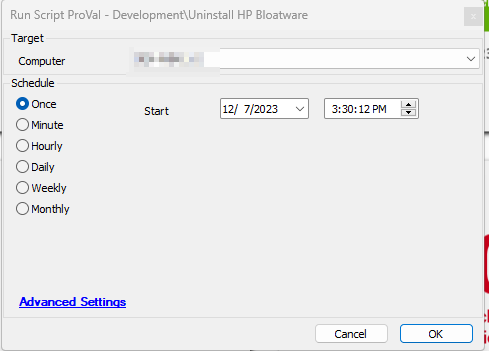

## Summary

The script is designed to uninstall all HP bloatware from Windows workstations. It will only be considered unsuccessful if it encounters a failure while attempting to uninstall any of the HP bloatware. In cases where it successfully uninstalls some of the software but encounters issues with others, it will exit the process while logging the list of uninstalled software components. 

Note* If the 'ticketcreationcategory' under the globals of the script is set to something other than 0, it will create a ticket listing any individual software uninstallation failures and not only log the information.

## Sample Run

## Global Variables

| **Name**                  | **Default** | **Mandatory** | **Description**                                                                                                                                                       |
|---------------------------|-------------|---------------|-----------------------------------------------------------------------------------------------------------------------------------------------------------------------|
| TicketCreationCategory     | 0           | False         | Set it to '0' to disable ticketing. Mention the ticketcreationcategory to direct the tickets to the right board and to enable the tickets.                           |

## Output

- Script log
- Ticketing

## Ticketing

The tickets will be generated only if TicketCreationCategory value is greater than 0 in global parameters. Make sure to use the correct ticketcreationcategory to direct the tickets to the right board.

Subject : `Uninstall HP Bloatware Failed on %ComputerName%(%ComputerID%)`

Ticket Body: `Script failed in uninstalling any HP bloatware from %ComputerName%. Here is the Uninstallation Attempt results : @psout@`

The PC information is outlined below:  
PC Name: %computername%  
Last Login: %lastuser%  
PC model: @biosname@  
OS: %os%  
S/N OF PC: @biosver@

If Script fails in uninstalling some of the HP Bloatware from the machine but uninstalls the rest of them

The script has successfully removed all unnecessary HP bloatware, leaving only the following software components:  
`@RemainingUninstalledSoftwares@`

