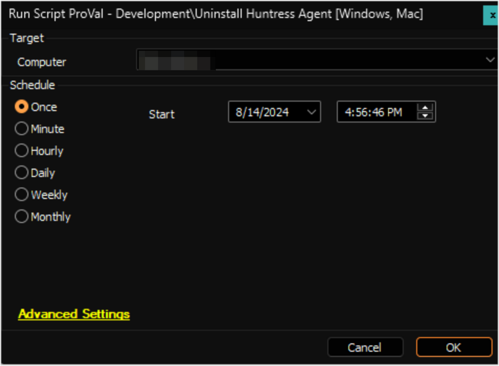

## Summary

This script can be used to uninstall Huntress Agent from both Windows and Macintosh machines.

---

**File Hash:**

- **MD5:** `8F19848478D623C13615D166134FE8C1`
- **SHA256:** `DFC9C59A249E2C5EA0E3AD26CD9639F7F6953FF9781A17823BF84A6009627076`

## Sample Run

## Dependencies

[raw.githubusercontent.com/huntresslabs/deployment-scripts/main/Powershell/InstallHuntress.powershellv2.ps1](https://raw.githubusercontent.com/huntresslabs/deployment-scripts/main/Powershell/InstallHuntress.powershellv2.ps1)

## Variables

| Name                | Description                                                       |
|---------------------|-------------------------------------------------------------------|
| projectName         | Invoke-HuntressAgentCommand                                       |
| workingDirectory     | C:/ProgramData/_Automation/Script/Invoke-HuntressAgentCommand    |
| scriptPath          | C:/ProgramData/_Automation/Script/Invoke-HuntressAgentCommand/Invoke-HuntressAgentCommand.ps1 |

## Output

- Script log

