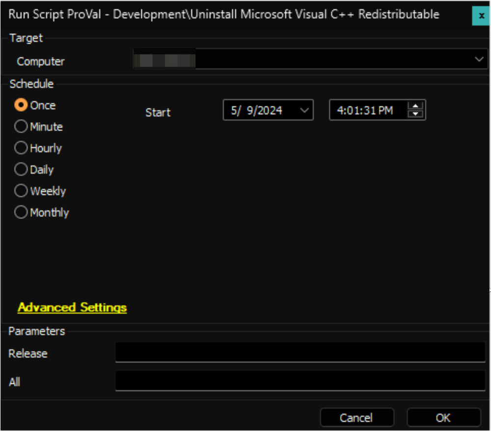

## Summary

An Automate implementation of the [Invoke-VcRedistModule](<../../powershell/Invoke-VcRedistModule.md>) agnostic script to uninstall Microsoft Visual C++ Redistributable. By default, the script will uninstall the unsupported redistributable unless a user parameter is set.

## Sample Run

## Variables

| Name              | Description                      |
|-------------------|----------------------------------|
| ProjectName       | Invoke-VCRedistModule            |
| WorkingDirectory   | C:/ProgramData/_automation/script/Uninstall-VCRedist |

#### User Parameters

| Name     | Example                | Required | Description                                                             |
|----------|------------------------|----------|-------------------------------------------------------------------------|
| Release  | 20072007,2008,2012 | False    | Set the release id(s) of the Redistributable to remove.                |
| All      | 1                      | False    | Setting this parameter to 1 will remove all installed Redistributable from the computer. |

## Output

- Script Log

