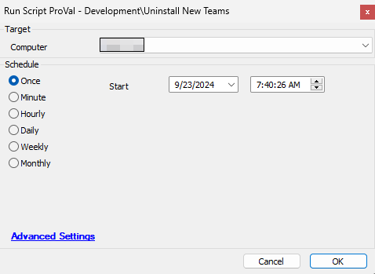

## Summary

The script uninstalls `New Teams` from Windows machines. It will only work for the computers with a logged-in user.

**File Path:** `C:/ProgramData/_Automation/Script/Uninstall-NewTeams/Uninstall-NewTeams.ps1`

**File Hash (SHA256):** `B1A3E764F1384A9E15E0B9B8DDAF8E2E093FA52CEA82446C89A38D216E039883`

**File Hash (MD5):** `17F1C8FED7120443E532FECD7D460B80`

## Sample Run

#### Global Parameters

| Name                     | Required | Example | Description                                                                                   |
|--------------------------|----------|---------|-----------------------------------------------------------------------------------------------|
| Ticket_On_Failure        | False    | 1       | Fill it as '1' if you would like to receive Ticket on failure else leave it blank or '0'    |
| TicketCreationCategory    | False    | 298     | Mention the ticketcreationcategory in order to direct the tickets to the right board in Manage |

## Output

- Script Logs
- Ticket (if enabled)

## Ticketing

Subject: `New Microsoft Teams Uninstallation Failed on %ComputerName%(%ComputerID%)`

Ticket Body: `Failed to Uninstall New Microsoft Teams from machine on %computername% at %clientname%. Here are the results returned from the installer: @psout@`

The PC information is outlined below:  
PC Name: %computername%  
Last Login: %lastuser%  
PC model: @biosname@  
OS: %os%  
S/N OF PC: @biosver@

