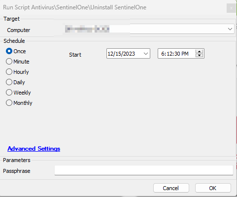

## Summary

This document provides a script designed to uninstall the SentinelOne agent from Windows machines. Either Tamper Protection or a passphrase is required to uninstall SentinelOne from the machine. It is recommended to reboot after the uninstallation of SentinelOne. If SentinelOne is uninstalled as per the Automate database, the script will not flag or issue any reboot. However, if it fails to determine the status, the script will flag the machine for reboot if a user is logged in and will issue a reboot if no user is logged in.

## Sample Run

## Global Variables

| **Name**   | **Example**                                                                 | **Mandatory**                                               | **Description**                                                                                                                                               |
|------------|-----------------------------------------------------------------------------|------------------------------------------------------------|---------------------------------------------------------------------------------------------------------------------------------------------------------------|
| Passphrase | COSE CUNY BADE MITT IDEA YTYI BANG FEW TWO LEAD SURE BOSE                 | True (False if Tamper Protection is disabled)             | Enter the passphrase for the machine. This passphrase can be obtained from the SentinelOne Portal. Go to machine > actions and select "Show Passphrase."  |

## Output

- Script log

