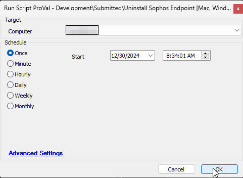

## Summary

The script is designed to uninstall Sophos Endpoint Protection from both Mac and Windows computers. To use the script, tamper protection must be disabled on the machine beforehand.

## Sample Run

## Output

- Script logs

