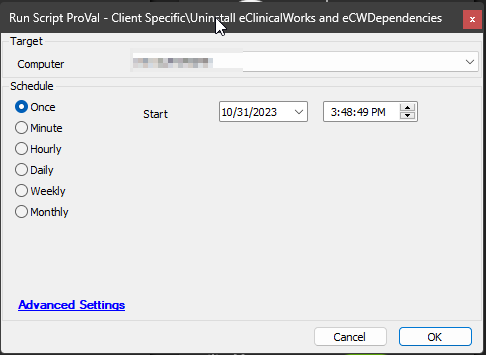

## Summary

This script is designed to uninstall the eClinicalWorks Client and eCWDependencies applications from the computer. In case of failure, it generates a ticket for further assistance.

## Sample Run

## Output

- Script log
- Ticket

