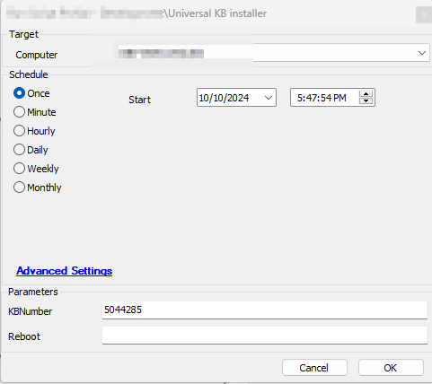
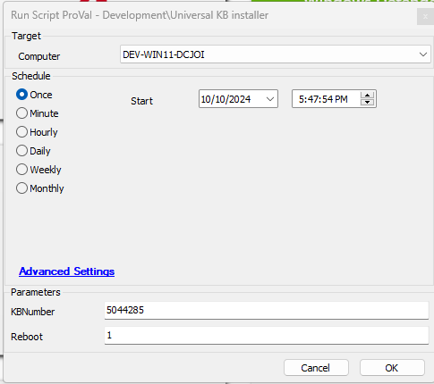

## Summary

The purpose of this script is to install the desired patch on Windows machines.

## Sample Run

Leave the Reboot parameter blank or set it to '0' to prevent the machine from rebooting.  
  

Set the Reboot parameter to '1' to reboot the machine.  

  

### User Parameters

| Name     | Example   | Required | Description                                                                                   |
|----------|-----------|----------|-----------------------------------------------------------------------------------------------|
| KBNumber | 5044285   | True     | KB ID Number of the patch that needs to be installed.                                        |
| Reboot   | 0         | False    | Set this value to '1' to reboot the machine after patch installation during script execution. Leave it blank or set it to '0' to prevent the machine from rebooting. |

## Output

- Script Logs

