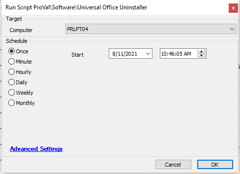

## Summary

This script downloads the offscrub files from the LTShare and then attempts to uninstall all versions of Microsoft Office from 2007 to 2016 & O365. It can deal with machine or software corruption and completely removes Office app shortcuts for the version.

Time Saved by Automation: 5 Minutes

## Sample Run

## Dependencies

- All the Off Scrub files and PS1 file should be present in LTShare

## Process

- Checks if office is installed on the machine
- Downloads the off scrub files and PS1 file from the LTShare 
- Run the ps1 file and logs the result

## Output

- Script log

