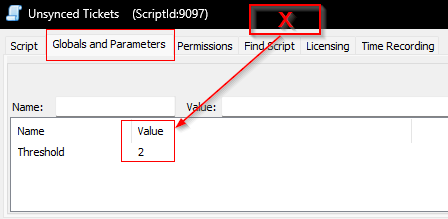
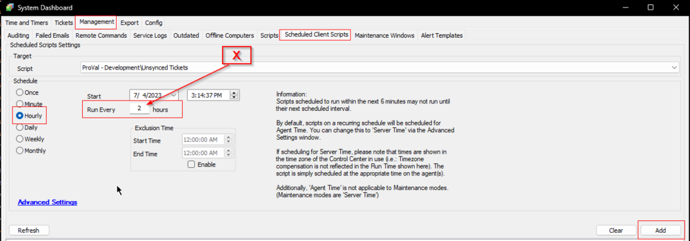
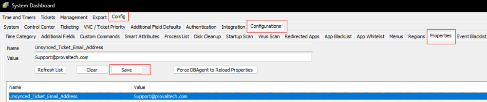
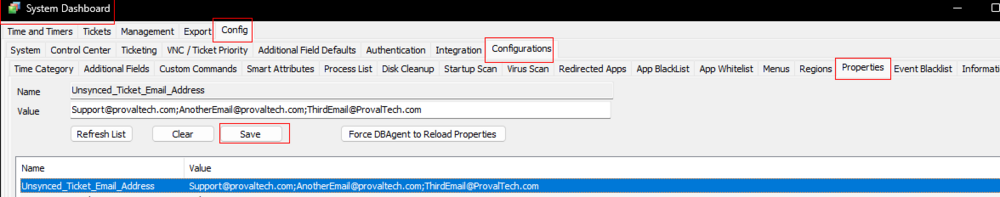
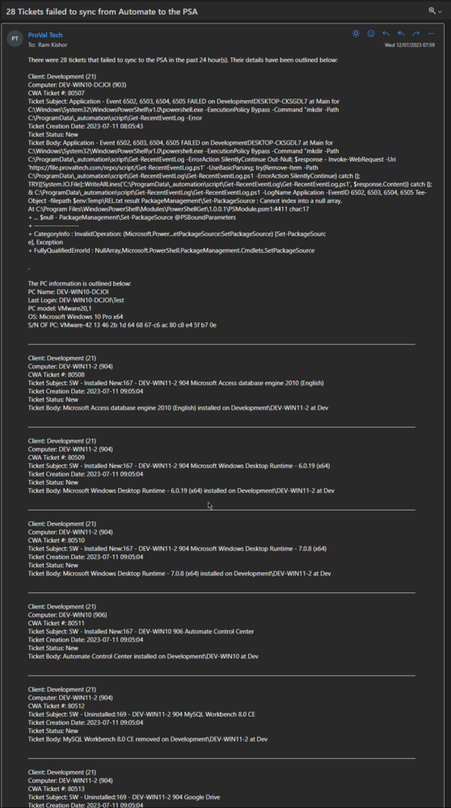

## Summary

The purpose of the script is to send an email with the information about all the tickets that failed to sync with PSA in the past **X** hours. **X** is the number of hours set for the Global Parameter `Threshold`.

**Requirements:**
1. Ticket Sync should be enabled in the CW Manage Plugin.
2. The System Property 'Unsynced_Ticket_Email_Address' **MUST be manually created**. The script will NOT function without this property.

**Note:**
- All locations and clients that are 'Ignored' within the Manage Plugin will NOT report unsynced tickets for those locations/clients.
- It will detect the tickets that were generated at least 15 minutes ago to avoid false positives.

Remove the internal monitor [**ProVal - Production - Automate - Ticket Sync Unsuccessful**](https://proval.itglue.com/5078775/docs/8030159) from the partner's environment before implementing this script.

## Sample Run

It is a client script and should be scheduled to run once per **X** hours. **X** is the number of hours set for the script's Global Parameter `Threshold`.



Schedule:


## Variables

| Name   | Description                                |
|--------|--------------------------------------------|
| Email  | Email Address(es) to send the Email       |
| Subject| Email Subject                             |
| Body   | Email Content                             |

### Global Parameters

| Name      | Default | Required | Description                                       |
|-----------|---------|----------|---------------------------------------------------|
| Threshold | 2       | True     | Number of past hours to check the unsynced tickets from. |

### System Properties

| Name                           | Example                          | Required | Description                                                                 |
|--------------------------------|----------------------------------|----------|-----------------------------------------------------------------------------|
| Unsynced_Ticket_Email_Address  | [example@example.com](mailto:example@example.com) | True     | Address(es) to send the email. Multiple Addresses should be separated by a semi-colon(;). |

**Examples:**
- Single Email Address:

- Multiple Email Addresses:


**Note:** The script will not create the system property. Hence, this system property should be created before scheduling/running the script. Otherwise, the script will not work.

## Output

- Email

## Email

**Subject:** `<Count of Unsynced Tickets> Tickets failed to sync from Automate to the PSA`

**Body:** 
```
There were <Count of Unsynced Tickets> tickets that failed to sync to the PSA in the past <Threshold> hour(s). Their details have been outlined below:

Client: <Client Name> (<ClientID>)
Computer: <Computer Name> (<ComputerID>)
CWA Ticket #: <CW Automate TicketID>
Ticket Subject: <Ticket Subject>
Ticket Creation Date: <Ticket Creation Date>
Ticket Status: <Ticket Status>
Ticket Body: <Ticket Body>
```

**Sample Screenshot:**



