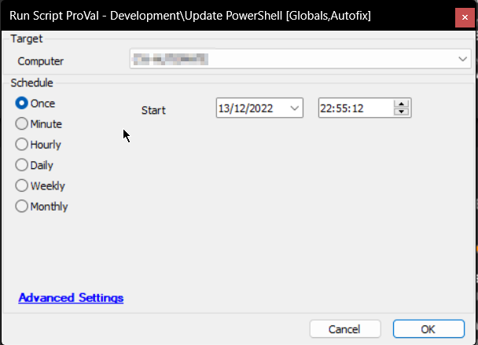

## Summary

This document outlines the process to update PowerShell Desktop to the latest version. It can create tickets and send emails for failures while being used as an Autofix.  
**Note:** Global Parameters must be properly set to use the script as an Autofix.

## Sample Run

  
This will update the current PowerShell V2 to PowerShell V5.

## Dependencies

This should be a list of ITGlue documents listed in the Related Items sidebar on which this script depends.  
- [EPM - Windows Configuration - Agnostic - Update-PowerShell](/docs/04754010-1cd6-426b-ba7d-55ae36e60f53  )

## Global Parameters

| Name              | Default | Required | Description                                                                                         |
|-------------------|---------|----------|-----------------------------------------------------------------------------------------------------|
| EnableTicketing   | 1       | False    | 1/0 to toggle between ticket creation for failures while being used as an Autofix.                |
| FailureEmail      | 0       | False    | 1/0 to Opt-In/Opt-Out Emails for failures while being used as an Autofix.                         |
| SuccessEmail      | 0       | False    | 1 to receive success emails as well, 0 to ignore. Only usable when FailureEmail is set to 1.      |
| EmailAddresses    |         | True     | (Only if FailureEmail = 1) Email Address(es) to send the failures to. Multiple emails must be separated by a semicolon. e.g., [abc@def.com](mailto:abc@def.com); [ghi@jkl.com](mailto:ghi@jkl.com); [mno@pqr.com](mailto:mno@pqr.com) |

## Process

### For Manual Execution:
- Check the computer for a pending reboot. If one exists, log the error and stop the process.
  - Please review the agnostic content document for specifics on the process.

### While being used as an Autofix:
- Creates/finishes the ticket and sends emails according to the monitor set results and Global Parameters settings.
  - It will comment on any active open tickets instead of creating a new ticket each time.

## FAQ

**Question:**  
Can I modify this script to add a pop-up for a user to schedule their own reboot?  
- No, User-Prompt Show and prompter are written for PowerShell V5 or above.

**Question:**  
Is there anything the end user will experience due to running this script?  
- Yes, if a user is logged on to the computer during the time this script is running, the user will see an alert pop up in the bottom right-hand corner of the screen informing them that there is an important update that requires a reboot to complete. A yellow-bordered pop-up may appear requesting a reboot, which can be granted or postponed.

**Question:**  
The script keeps failing on this machine, why?  
- You should be able to see the reasons why the script failed in the script logs for that machine. You can expect script failures if any of the following conditions are true, and the log will reflect this:
  - Target OS is Windows XP, 2003, or Vista/2008 because PowerShell V5 is not available for these operating systems.
  - Target OS is Windows 10 or Server 2016 because PowerShell V5 is installed by default on these systems.
  - Target OS is Windows 7 or Server 2008R2 but not SP2 because SP2 must be installed to install PowerShell V5.
  - Target OS is Windows 8 because PowerShell V5 is not applicable to this operating system.
  - Target OS is Windows 7 or Server 2008R2 SP2 but missing .NET Framework 4.5.2 or greater because .NET 4.5.2 is required.

