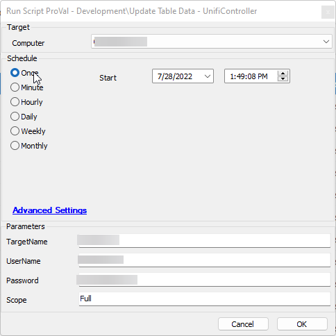

## Child of Solution

[EPM - Data Collection - Solution - CWA - Update Table Data - UnifiController](/docs/59fbb11b-df98-46a4-9b97-986b4f8e16f9)  

## Summary

This script launches the Get-UnifiController.ps1 file from the registry, filters out the needed information, and populates the following tables with data:

- [CWM - Automate - Custom Table - plugin_proval_unificontroller](/docs/317fccab-60e6-4af7-8866-1b4d862d973e)
- [CWM - Automate - Custom Table - plugin_proval_unifidevices](/docs/048bcde3-a1b4-45a9-a86c-ba19c0a40933)
- [CWM - Automate - Custom Table - plugin_proval_unifiwireless](/docs/e4a1a60d-1e35-4336-a1a3-28e2ffb12855)

## Sample Run

## Dependencies

This should be a list of ITGlue documents listed in the Related Items sidebar on which this script depends.

- [EPM - Data Collection - Agnostic - Script - Get-UnifiController](/docs/d5d5fe24-6009-48cf-9d51-ac4763a1be7f)
- [CWM - Automate - Custom Table - plugin_proval_unificontroller](/docs/317fccab-60e6-4af7-8866-1b4d862d973e)
- [CWM - Automate - Custom Table - plugin_proval_unifidevices](/docs/048bcde3-a1b4-45a9-a86c-ba19c0a40933)
- [CWM - Automate - Custom Table - plugin_proval_unifiwireless](/docs/e4a1a60d-1e35-4336-a1a3-28e2ffb12855)

## Variables

Document the various variables in the script. Delete any section that is not relevant to your script.

| Name                | Description                                                                                   |
|---------------------|-----------------------------------------------------------------------------------------------|
| ControllerTableName | Holds the name of the Unifi Controller's data table.                                        |
| DeviceTableName     | Holds the name of the Unifi Device's data table.                                            |
| WifiTableName       | Holds the name of the Unifi Wireless data table.                                            |
| ControllerSqlInsert  | Populates the insert statement for the ControllerTableName table.                           |
| SQLInsert            | This variable is created by splitting the output of the PowerShell command; it holds the insert statement for either the DeviceTableName or the WifiTableName tables. |
| totalRowsToWrite    | This variable is created by splitting the output of the PowerShell command; it holds the total rows needed to write to complete all items found. |
| totalRowsToLimit    | This variable is created by splitting the output of the PowerShell command; it holds the total amount of rows that the command can fit before exceeding the 65,000 character limit. I intentionally left about a 500 character padding. |

#### Global Parameters

| Name  | Example | Required                       | Description                                           |
|-------|---------|--------------------------------|-------------------------------------------------------|
| Port  | 8443    | False, defaults to 8443        | The port in which the Unifi Controller communicates. |

#### User Parameters

| Name        | Example                                                                                       | Required | Description                                                         |
|-------------|-----------------------------------------------------------------------------------------------|----------|---------------------------------------------------------------------|
| TargetName  | 10.125.56.152, [LocalHost](https://somecompany/unifi)                                       | True     | The URL, HostName, or IP address of the Unifi Controller           |
| UserName    | JoesSnackShack                                                                                | True     | The username for an admin account on the Unifi Controller.          |
| Password    | jndfgsjkoli908435!@_435j                                                                      | True     | The password for the admin account provided above.                  |
| Scope       | Full                                                                                          | False    | Under Empty or Null operation, this script will populate data into the following tables: plugin_proval_unificontroller, plugin_proval_unifidevices. Under `Full` operation, this script will additionally populate the following table: plugin_proval_unifiwireless. |

## Process

Describe the steps the script performs to accomplish the desired task. Note that if this script is just a front-end for a piece of Agnostic Content, then you can insert a link to the documentation for that content here instead.

1. Downloads, executes, and formats the results of [EPM - Data Collection - Agnostic - Script - Get-UnifiController](/docs/d5d5fe24-6009-48cf-9d51-ac4763a1be7f) to accomplish the following:
   1. Create two files on the target machine: MyUnifiController.json and MyUnifiControllerNetworks.json, containing objects for the Unifi Controller tables.
   2. Read the data and return to Automate the following variables/values:
      - totalRowsToWrite
        - The total amount of rows that need to be written to the insert statement to complete the file.
      - totalRowsToLimit
        - The total amount of rows that can be added to the insert statement before the character limit, including the statement before the data and the completing statement at the tail end, reaches 65,000.
      - sqlInsert
        - The character-limited SQL statement to execute.
   3. Overwrite the MyUnifiController.json file with all the values, skipping totalRowsToLimit items.
2. Creates the ControllerTableName insert statement needed to populate data.
3. Creates the ControllerTableName table if it doesn't exist.
4. Runs the ControllerTableName insert statement.
5. Creates the DeviceTableName.
6. Executes the first returned sqlInsert statement.
7. Creates the WifiTableName.
8. Checks the totalRowsToWrite against the totalRowsToLimit:
   - If totalRowsToWrite is greater:
     1. Executes an SQL statement to accomplish the following:
        1. Read the MyUnifiController.json file.
        2. Return the following values:
           - ControllerID
           - totalRowsToWrite
           - totalRowsToLimit
           - sqlInsert
        3. Overwrite the MyUnifiController.json file with all the values, skipping totalRowsToLimit items.
     2. Split the variables.
     3. Execute sqlInsert.
     4. Checks the totalRowsToWrite against the totalRowsToLimit. Returns to step 8 if totalRowsToWrite is greater.
9. Checks to see if Scope is "Full".
10. Logs all output.
11. Deletes the following files:
    - MyUnifiController.json
    - MyUnifiControllerNetworks.json
12. Exits.

## Output

- Script log

