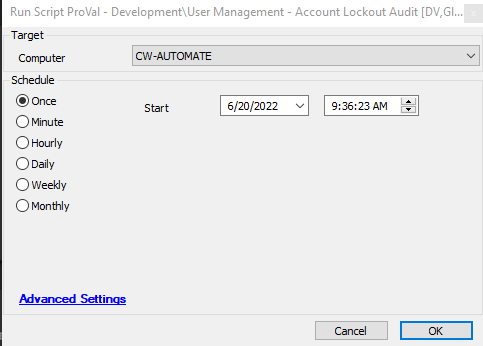

## Summary

This script audits locked accounts and stores the information in a table.

## Sample Run

## Dependencies

- [Account LockOut Audit](<../../cwa/dataviews/Account LockOut Audit.md>)
- [AD Account Lockout Detection](<../../cwa/monitors/Account Lockout Detection.md>)
- [plugin_proval_account_lock](<../../cwa/tables/plugin_proval_account_lock.md>)

## Variables

Document the various variables in the script. Delete any section that is not relevant to your script.

| Name       | Description                          |
|------------|--------------------------------------|
| LockAudit  | This contains the locked user detail |

#### Global Parameters

| Name         | Example                                             | Required | Description                                         |
|--------------|-----------------------------------------------------|----------|-----------------------------------------------------|
| Email        | [abc@xyz.com](mailto:abc@xyz.com); [efg@tty.com](mailto:efg@tty.com) | False    | Email address to send email on Lockout Detail      |
| Email_Option | 1 or 0                                            | False    | 0 - No Email by default; 1 - Send email to the provided address |

## Process

This script audits locked accounts and stores the information in a table based on the security event log 4740. It retains this information for future reference and displays it in the dataview.

## Output

The location and method by which this script returns data.

Examples:

- Script log
- plugin_proval_account_lock
- Dataview

