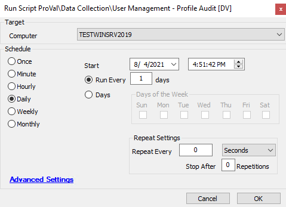

## Summary

Superseded by [EPM - Accounts - Script - User Profile - Get Information](<./User Profile - Get Information.md>).

This script looks for user profile information at the machine level. It provides information about whether a user is local/domain, admin or not, password set or not, profile size, last logon, and the timestamp of the audit.

**Time Saved by Automation:** 15 Minutes

## Sample Run

## Dependencies

- @Windows – Local Account Audit (script)
- Requires Windows OS
- [custom_proval_computer_accounts](<../tables/custom_proval_computer_accounts.md>)

## Variables

- `@output@` -> Output from the PowerShell script
- `@dataValidation@` -> RegEx matching setup

## Process

1. This script creates the [custom_proval_computer_accounts](<../tables/custom_proval_computer_accounts.md>) table if it doesn't exist.
2. Runs a PowerShell script to gather the list of users, properties, and sizes.
3. Logs the output in Automate's script logs.
4. Trims the PowerShell output via SQL and performs a RegEx to verify data.
5. Conducts a verification step of the data.
   1. Logs a failure in Automate's script logs if there was an issue verifying the data.

## Output

- Script log
- [custom_proval_computer_accounts](<../tables/custom_proval_computer_accounts.md>)
- @Windows – Local Account Audit (Dataview)
