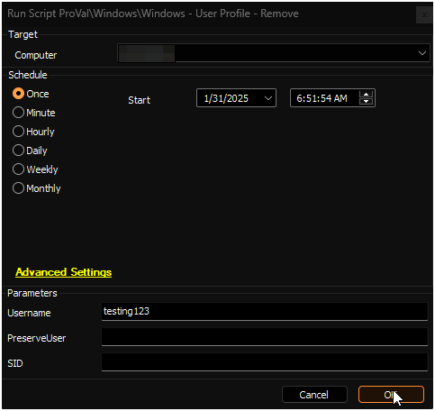
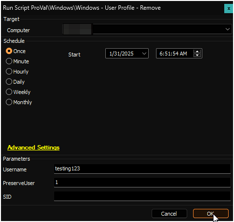
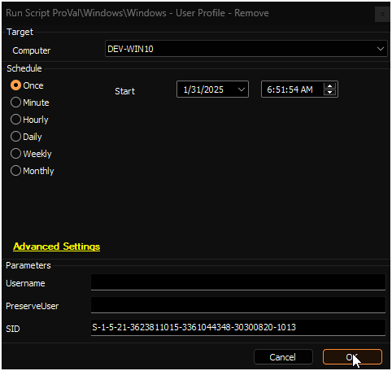

## Summary

### ***This script is destructive and should only be used after fully understanding the implications.***

This script deletes a user profile and removes the user account if it is local. It runs [User Profile - Get Information](<./User Profile - Get Information.md>) after successful deletion.

## Sample Run

#### Example 1: Removes user profile and the local user from the machine

#### Example 2: Removes user profile without removing the local user

#### Example 3: Removes user profile based on SID. SID parameter can be used when UserName is not available. 

## Dependencies

- [Remove-UserProfile](<../../powershell/Remove-UserProfile.md>)
- [User Profile - Get Information](<./User Profile - Get Information.md>)

### User Parameters

| Name         | Example    | Required  | Description                                                                                          |
|--------------|------------|-----------|------------------------------------------------------------------------------------------------------|
| Username     | testuser   | Partially | The username of the user to remove. Can be in the format 'testuser', './testuser', or 'domain/testuser'. |
| PreserveUser | 1          | False     | If set to 1, then the user account will not be deleted along with the profile.                     |
| SID | S-1-5-21-3623811015-3361044348-30300820-1013 | Partially | The SID of the user profile to remove. Preserve User can not be used with SID. This parameter can be used when can be used when UserName is not available.  **Both UserName and SID can not be used together** |

## Process

See [Remove-UserProfile](<../../powershell/Remove-UserProfile.md>) for process information.

## Output

- Script log
- Local file on computer