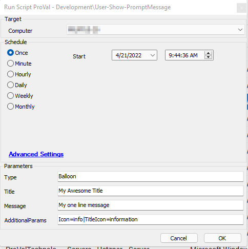
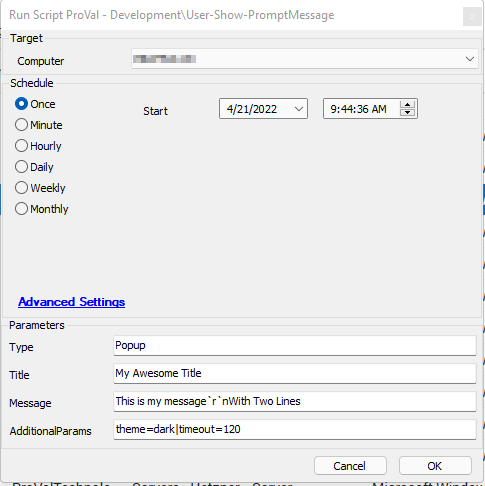

## Summary

This script will display a customizable pop-up or balloon message on target machines. It offers customizable options for pop-up displays, including text size, color, themed displays, image insertion, and selectable date/times for users to choose from.

## Requirements

1. A high-level understanding of the agnostic script and the guide for this agnostic script is required to guarantee success.

## Sample Run

1. Balloon messages  
     

2. Pop-Up Message  
     

## Dependencies

- [EPM - Agnostic - Prompt-User](https://proval.itglue.com/DOC-5078775-9580402)  
  - [https://app.myglue.com/help_center/documents/9580402](https://app.myglue.com/help_center/documents/9580402)  
- [Guide - Prompt-User.Ps1](https://proval.itglue.com/DOC-5078775-9580488)  
  - [https://app.myglue.com/help_center/documents/9580488](https://app.myglue.com/help_center/documents/9580488)  

## Variables

Document the various variables in the script. Delete any section that is not relevant to your script.

| Name                | Description                                                                                                                                              |
|---------------------|----------------------------------------------------------------------------------------------------------------------------------------------------------|
| Type                | The type of message you desire to send to the user: Popup, CustomizedPopup, or Balloon.                                                                |
| Title               | The title of the balloon or pop-up message without quotations.                                                                                           |
| Message             | The body of the balloon or pop-up without quotations. For Balloon, only one line is available; for Popup, separate lines with `r`n.                     |
| AdditionalParams    | Contains a list of additional parameters provided to the script for processing.                                                                          |
| Params              | Holds a running modified list of parameters passed to the agnostic script.                                                                              |
| ProjectName         | Holds the name of the ps1 file without the .ps1 extension.                                                                                              |
| WorkingDirectory     | Holds the working directory of the script.                                                                                                              |
| Ps1Log              | Holds the name and location of the log file related to this script.                                                                                     |
| Ps1DataLog          | Holds the name and location of the data file related to this script.                                                                                   |
| Ps1ErrorLog         | Holds the name and location of the error file related to this script.                                                                                   |
| ButtonType          | Used for Popup or CustomizedPopup type messages to select the type of button you wish to display on the popup. Please reference the agnostic guide for more information. |
| Theme               | Used for Popup or CustomizedPopup type messages to select the desired theme. Please reference the agnostic guide for more information.                   |
| Timeout             | Used for Popup, CustomizedPopup, or Balloon type messages to select the desired timeout for the message. Please reference the agnostic guide for more information. |
| AddImage            | Used for Popup or CustomizedPopup type messages to add an image to the message. Please reference the agnostic guide for more information.               |
| ImageMaxHeight      | Used to set the maximum height of the added image.                                                                                                      |
| ImageMaxWidth       | Used to set the maximum width of the added image.                                                                                                       |
| TitleFontSize       | Used for Popup or CustomizedPopup type messages to specify the size of the title text. Please reference the agnostic guide for more information.         |
| MessageFontSize     | Used for Popup or CustomizedPopup type messages to specify the size of the message text. Please reference the agnostic guide for more information.       |
| AddDateTimeSelection | Used for Popup or CustomizedPopup type messages to specify that you would like to include a date/time selection for the user in your message. Please reference the agnostic guide for more info. |
| IncrementMinutes     | Used for Popup or CustomizedPopup type messages when you specify AddDateTimeSelection. It populates the minute increment between selectable times in the date/time selection box in the message. Please reference the agnostic guide for more information. |
| DurationDays        | Used for Popup or CustomizedPopup type messages when you specify AddDateTimeSelection. It populates the amount of days you would like to display in the date/time selection box in the message. Please reference the agnostic guide for more information. |
| CustomButtons       | Used for CustomizedPopup messages; this option allows you to place a customized button in the message if desired. Please reference the agnostic guide for more information. |
| TitleBackgroundColor | Used for CustomizedPopup messages; this sets the background color of the title section of a popup message. Please reference the agnostic guide for more information. |
| MessageBackgroundColor | Used for CustomizedPopup messages; this sets the background color of the message body of a popup message. Please reference the agnostic guide for more information. |
| TextFont            | Used for CustomizedPopup messages; this sets the font type for the entire popup. Please reference the agnostic guide for more information.             |
| MessageTextColor    | Used for CustomizedPopup messages; this sets the text color in the message body of the popup. Please reference the agnostic guide for more information. |
| Icon                | Used for Balloon type messages; this sets the message icon in the balloon message. Please reference the agnostic guide for more information.         |
| TitleIcon           | Used for Balloon type messages; this sets the title icon for the balloon message. Please reference the agnostic guide for more information.         |
| UserSelection       | Holds the selected item from the user after they select a date/time or button press.                                                                    |
| CornerRadius        | Used for Popup and CustomizedPopup messages; this sets the roundedness of the corners of the pop-up.                                               |
| Layout              | Used for Popup and CustomizedPopup messages; this toggles the layout from vertical to horizontal.                                                  |
| AddTitleIcon        | Used for Popup and CustomizedPopup messages; this adds an icon to the left corner of the title bar.                                               |

#### User Parameters

| Name               | Example                        | Required | Description                                                                                           |
|--------------------|--------------------------------|----------|-------------------------------------------------------------------------------------------------------|
| Type               | Balloon                        | True     | The type of message you are sending (balloon, customizedpopup, or popup).                           |
| Title              | My awesome title               | True     | The title of the message you are displaying, no quotations.                                          |
| Message            | This is my message             | True     | The text you wish to be in the body of the balloon or popup. On Popup or CustomizedPopup, separate new lines with `r`n. |
| AdditionalParams   | icon=info|Titleicon=information | False    | Holds all additional potentially used variables separated by | without any spaces between. See above for all available options or reference the agnostic guide for usage. |

## Process

1. Set static variables.
2. Check all potential additional parameters and add them to the params variable if present.
3. Download the agnostic ps1 file.
4. Use console shell to display the message.
5. Store the user selection in the UserSelection variable.

## Output

- The selection made by the user will be stored in the `UserSelection` variable in the script.
  - If you select date/time selection, it will return the selected date/time from the user.
  - If you select a yes-no button, a yes or no will be returned.

