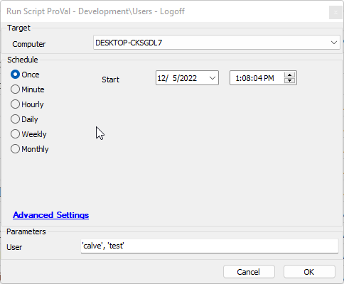
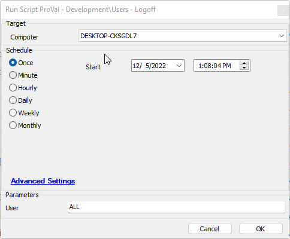

## Summary

This script will log off a user, multiple users, or all users.

## Sample Run

Setting the User parameter to this will log off the user named 'calve' and the user named 'test'.

Setting the User parameter to "All" will log off all users.

#### User Parameters

| Name   | Example                       | Required | Description                                          |
|--------|-------------------------------|----------|------------------------------------------------------|
| User   | 'someone', 'someoneelse', 'All' | True     | The target user, multiple users, or all users to log off the machine. |

## Process

1. Determine the scope.
2. Log off the desired user or users.

