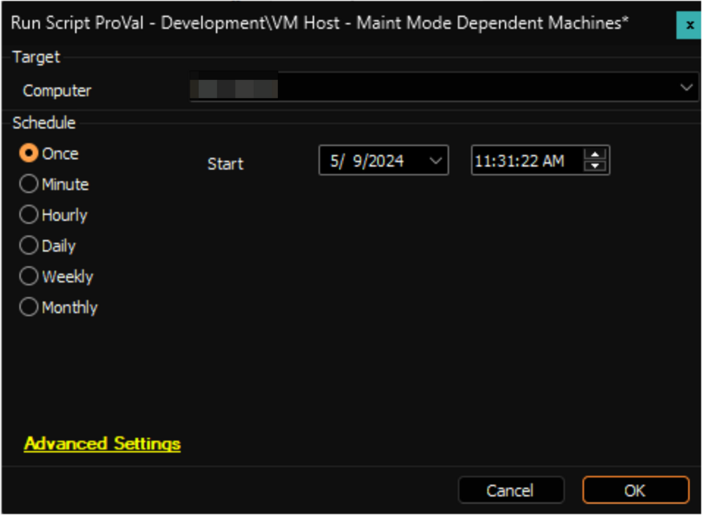
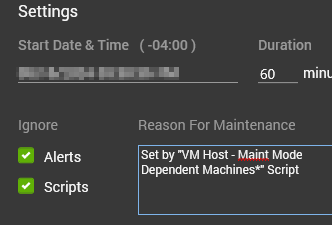

## Summary

The script will place the virtual machines hosted on a Hyper-V Host into Maintenance mode for 60 minutes. During this maintenance period, alerts will not be generated, and script execution will be restricted on these virtual machines.

## Sample Run

What will get set on all VMs running with an Automate Agent on the host:

