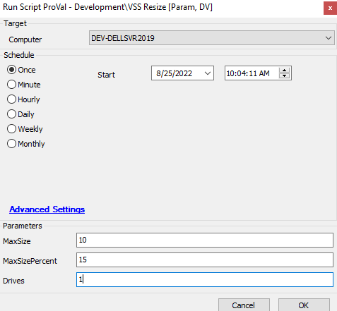

## Summary

This script will reset the vssadmin size and also update the table with the latest size detail.

## Sample Run

## Dependencies

- [VSSAdmin Storage Audit](<../dataviews/VSSAdmin Storage Audit.md>) 
- [Vssadmin List Storage Audit](<./Vssadmin List Storage Audit.md>) 
- [plugin_proval_vssadminstorage](<../tables/plugin_proval_vssadminstorage.md>) 

## Variables

| Name  | Description                                                                                   |
|-------|-----------------------------------------------------------------------------------------------|
| psout | This contains the complete PowerShell output of vssadmin storage resize state               |

#### User Parameters

| Name            | Example | Required | Description                                                                                      |
|-----------------|---------|----------|--------------------------------------------------------------------------------------------------|
| Drives          | 1       | False    | 1 - All drives vssadmin resize,Leave blank or put anything - Only C: Drive                 |
| MaxSize         | 10      | False    | Set the vss maxsize for the volume in fixed specific size                                       |
| MaxSizePercent   | 10      | False    | Set the vss maxsize for the volume in percentage of its total size                              |

## Process

This script will reset the vssadmin size and also update the table with the latest size detail using PowerShell.  
This resizes the storage based on the user parameter.  
The script validates scope and resize success.

## Output

- Script log
- Table
- Dataview

