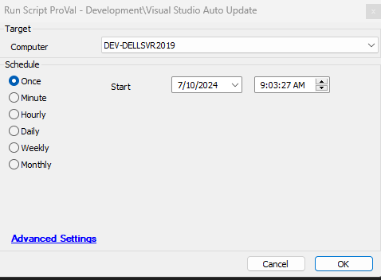

## Summary

This script performs the Visual Studio Auto Updates.  
It is compatible with the below applications only:  
- VS 2022 Enterprise  
- VS 2022 Community  
- VS 2019 Enterprise  
- VS 2019 Community  
- VS 2017 Enterprise  
- VS 2017 Community  

## Sample Run

  

## Dependencies

[Agnostic - Visual Studio Auto Update](https://proval.itglue.com/DOC-5078775-16390578)  

## Variables

Document the various variables in the script. Delete any section that is not relevant to your script.

| Name               | Description                                                                                                                                                          |
|--------------------|----------------------------------------------------------------------------------------------------------------------------------------------------------------------|
| @ProjectName@      | This contains the agnostic ps1 name and sets that as a project and working directory to C:/ProgramData/_Automation/Script/@ProjectName@.                         |
| @WorkingDirectory@  | This is a directory where the agnostic script download and its logging is stored. The directory path is "C:/ProgramData/_Automation/Script/@ProjectName@".      |
| @PS1Log@           | This stores the PowerShell informational logs for validation and stores them in the @WorkingDirectory@ folder with the name: @ProjectName@-log.txt.                |
| @PS1ErrorLog@      | This contains the PowerShell Error logs for the validation and stores them in the @WorkingDirectory@ folder with the name: @ProjectName@-error.txt.               |
| @ErrorLog@         | This contains the content of the error log file i.e. @ProjectName@-error.txt.                                                                                     |

## Output

- Script log

