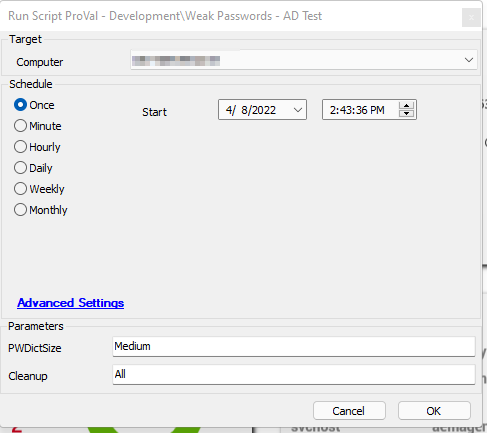

## Summary

This script utilizes the agnostic script [Test-WeakCredentials](<../../powershell/Test-WeakCredentials.md>) to test the hashed credentials in Active Directory against a known compromised or weak list. It returns items to be placed into a custom table `plugin_proval_ad_pwd_audit`.  

**File Path:** `C:/ProgramData/_automation/script/Test-WeakCredentials/Test-WeakCredentials.ps1`

**File Hash (SHA256):** `9D8F297FC48A28E71AE6AFAEE1907FD920976DB38C22A89C479332595E57547A`

**File Hash (MD5):** `977CA8E428D75CBE74971F49EB9E13FC`

**File Path:** `C:/ProgramData/_automation/script/Test-WeakCredentials/Test-WeakCredentialsAI.ps1`

**File Hash (SHA256):** `DFC8DDA4C2AF403421A38D7AB2992730BCC84EE49B8F3D7A743162F2F8CD4662`

**File Hash (MD5):** `3EEFAFB942FA1C2C5A34984937B34081`

## Sample Run

## Dependencies

1. The Active Directory Plugin needs to be installed and configured.
2. The machine this script is running on needs to be the Infrastructure Master Active Directory server.
3. This script is only supported on Server 2016 and above. Server 2012 may work but has not been tested.

- [EPM - Accounts - Agnostic - Script - Test-Credentials](https://proval.itglue.com/DOC-5078775-9590057)
- [AD - Create Views/Table/Schedule for AD Reporting Solution](<./AD - Create ViewsTableSchedule for AD Reporting Solution.md>)
- [EPM - Accounts - Report - Active Directory Reporting Solution](<../reports/Active Directory Reporting Solution.md>)
- [EPM - Accounts - Report - Active Directory User Assessment](<../reports/Active Directory User Assessment.md>)

## User Parameters

| Name         | Example | Mandatory | Default | Description                                                                                                                                                   |
|--------------|---------|-----------|---------|---------------------------------------------------------------------------------------------------------------------------------------------------------------|
| PWDictSize   | Small   | False     | Tiny    | The password list you desire to use based on a Validate Set of options; they include: <ul><li>Tiny</li><li>Small</li><li>Medium</li><li>Large</li></ul>   |
| Cleanup      | All     | False     |         | The extent of cleanup that you desire to run after script completion. The options are: <ul><li>All - this will remove all created or downloaded files, including 7zip, the 7za file, the extracted txt file, and the xml file created in the process</li><li>Text - This will remove just the .txt file</li><li>Zipped - This will remove just the downloaded 7za file.</li></ul> |

## Global Parameters

| Name      | Example                     | Required | Description                                                                                                                       |
|-----------|-----------------------------|----------|-----------------------------------------------------------------------------------------------------------------------------------|
| TableName | plugin_proval_ad_pwd_audit  | True     | Assigns the table name to the create table SQL query if not exists, or the table name to insert data into when the script returns results. |

## Output

This script is designed to output all data into the 'plugin_proval_ad_pwd_audit' table for reporting purposes. If anything fails, it will report that information to the script log.

- Script log

