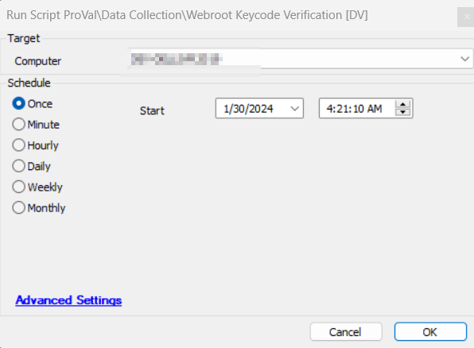
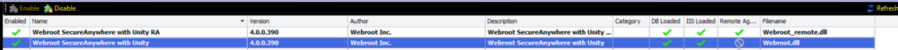

## Summary

This script collects the Webroot hashed keycode from the machine and further matches it with the keycode setup in the Webroot plugin and the keycode present on the machine. We can either review the results in the [Dataview - Webroot KeyCode Audit [Script]](https://proval.itglue.com/DOC-5078775-8105261), or this also creates a ticket for a keycode mismatch with the [Monitor - Execute Script - Webroot Keycode Verification](https://proval.itglue.com/DOC-5078775-14989291), when the monitor has a ticket category set.

## Sample Run

## Dependencies

Webroot SecureAnyWhere with Utility Plugin  

## EDFs

| **Name**                     | **Level** | **Required** | **Description**                                      |
|------------------------------|-----------|--------------|------------------------------------------------------|
| Webroot Encrypted KeyCode    | Computer  | True         | Stores keycode grabbed from computer                  |
| Webroot KeyCode Status       | Computer  | True         | Stored keycode's status either `KeyCode Matched` or `KeyCode Not Matched` |

## Output

- Script log
- EDF
- Dataview

