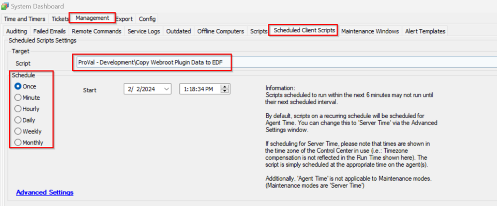

## Summary

This client script updates the client EDFs value from the Webroot plugin only when AutoDeploy is enabled in the plugin tables `plugin_webroot3_clients` or `plugin_webroot_sa_cls_basic`, depending on the Webroot version.

## Sample Run

## Dependencies

**Tables:**
- `plugin_webroot3_clients`
- `plugin_webroot_sa_cls_basic`

**Client EDFs:**
- Enable Webroot Deployment
- Webroot Site Keycode
- WorkstationWebrootGroupCode
- ServerWebrootGroupCode

## Output

- EDF
