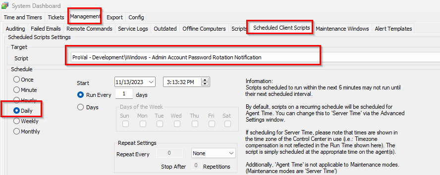

## Summary

This script will automatically create a ticket or send an email notification if the script 'Windows - Admin Account - Create/Update' updates a client-level Local Admin password. This will allow the partner to manually update a separate password management tool as the tickets come in.

## Update Notification: 11-14-23

Please be advised to promptly synchronize the script [EPM - Windows Configuration - Script - Windows - Admin Account - Create/Update](/docs/a3038ecc-f851-4327-b1ca-a4ca485f6f9c). Notably, there have been updates in the `SetEnvironment_Local_Admin_Process` function of the script, focusing on property imports. Additionally, script notes have been adjusted to include the required date for optimal functionality. If updating, please re-run the `SetEnvironment_Local_Admin_Process` function of the script to ensure that the system properties required for this script are imported.

## Sample Run

## Dependencies

[EPM - Windows Configuration - Script - Windows - Admin Account - Create/Update](/docs/a3038ecc-f851-4327-b1ca-a4ca485f6f9c)

## System Properties

| Name                                                    | Example                                    | Required | Description                                                                                                                                                                                                                                                                                                                                 |
|---------------------------------------------------------|--------------------------------------------|----------|---------------------------------------------------------------------------------------------------------------------------------------------------------------------------------------------------------------------------------------------------------------------------------------------------------------------------------------------|
| Default_Local_Admin_Password_Change_Notification_Client | 0                                          | False    | 1 -> This will enable the notification alerting for password updates; 0 -> By default set to 0, which will not allow the notification for password updates.                                                                                                                                                                               |
| Default_Local_Admin_Password_Change_Notification_Email  | [test@test.com](mailto:test@test.com); [msp@msp.com](mailto:msp@msp.com) | False    | Set the email address in this property to enable emailing from the notification script rather than ticket creation for password update notifications.                                                                                                                                                                                      |

## Output

- Ticket/Email  
  **Subject**:  
  Update Notification: Password Change for Username: @sqlUsername@ on Client (ID): @sqlName@ (@sqlClientid@)  

  **Body**:  
  We have recently detected an update to the password of an account @sqlUsername@ in the client: @sqlName@. The details are as follows:  
  Client Name (ID): @sqlName@ (@sqlClientid@)  
  To view the updated password, please follow the instructions below:  
  Open the client profile by double-clicking on it.  
  Navigate to the ‘Passwords’ section.  
  Search for the entry with the Title: ‘@sqlTitle@’ and Username: ‘@sqlUsername@’.  
  Please ensure that the password has notes with the date and time stored in it: ‘@sqlnotes@’, and that the ‘Updated Date’ of the password is @sqlLast_Date@.  
  To view and save the password in the portal, please double-click on the row.  

  ------------------------------------------------------------------------------------------------------------------------  

  Here, @sqlName@, @sqlUsername@, @sqlClientid@, @sqlTitle@, @sqlnotes@, and @sqlLast_Date@ contain the details of the Client Name, Username for which the password was updated, the Client ID of whom the user password was changed, Title name of the username, Notes of the user stored in the table which contains the last modified date, and Last_Date when the password change information was stored respectively.

