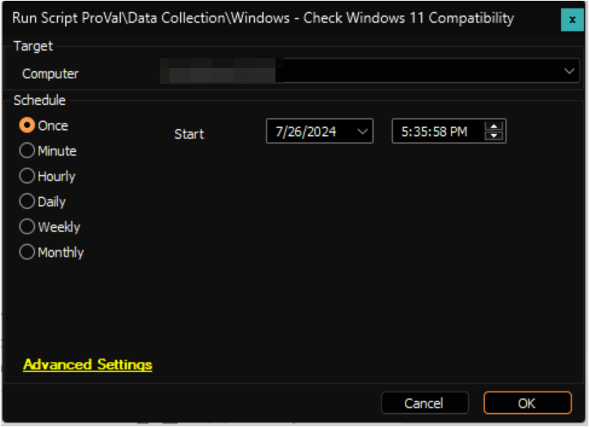

## Summary

The script will create the `plugin_proval_windows11_readiness` table if it's missing from the environment. It will then run a PowerShell script against the target Windows machine and update the [plugin_proval_windows11_readiness](<../tables/plugin_proval_windows11_readiness.md>) table with the relevant data. This data can be viewed in the [Windows 11 Upgrade Compatibility](<../dataviews/Windows 11 Upgrade Compatibility.md>) dataview.

## Sample Run

## Variables

| Name                | Description                                                                                      |
|---------------------|--------------------------------------------------------------------------------------------------|
| ProjectName         | Check-Windows11Compatibility                                                                     |
| WorkingDirectory     | C:/ProgramData/_Automation/Scripts/Check-Windows11Compatibility                                 |
| TableName           | [plugin_proval_windows11_readiness](<../tables/plugin_proval_windows11_readiness.md>)             |
| ScriptPath          | C:/ProgramData/_Automation/Scripts/Check-Windows11Compatibility/Check-Windows11Compatibility.ps1 |

## Output

Dataview: [Windows 11 Upgrade Compatibility](<../dataviews/Windows 11 Upgrade Compatibility.md>)  
Custom table: [plugin_proval_windows11_readiness](<../tables/plugin_proval_windows11_readiness.md>)

