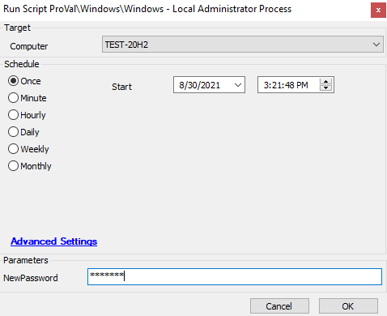

## Summary

Feb 2023 - See Updated Script - [https://proval.itglue.com/5078775/docs/7742920#version=published&documentMode=view](https://proval.itglue.com/5078775/docs/7742920#version=published&documentMode=view)

This script is used to create and set a local Administrator password for a client.

**Time Saved by Automation:** 10 minutes

## Sample Run

## Variables

| Variable          | Description                                                                                       |
|-------------------|---------------------------------------------------------------------------------------------------|
| passwordID        | Stores the password ID from the password table of the password title provided in the global parameter. |
| PrecedingInstance  | Stores the running thread ID to ensure whether the script is running or not.                     |

### Global Parameters

| Name             | Example                       | Required | Description                                                                                     |
|------------------|-------------------------------|----------|-------------------------------------------------------------------------------------------------|
| PasswordTitle     | Local Administrator Account    | True     | Stores the title name from the password tab whose password is required to reset.              |

### User Parameters

| Name             | Example     | Required | Description                                                       |
|------------------|-------------|----------|-------------------------------------------------------------------|
| NewPassword       | *********   | True     | Required to reset the password of the specified account.          |

## Process

The script will start by checking if the password entry already exists for the client. If it does, the script will proceed to set the local Administrator password to the existing password. If the password does not exist, the script will create a password using the passed "NewPassword" parameter. If a parameter is not passed, the script will error out.

## Output

- Script log

