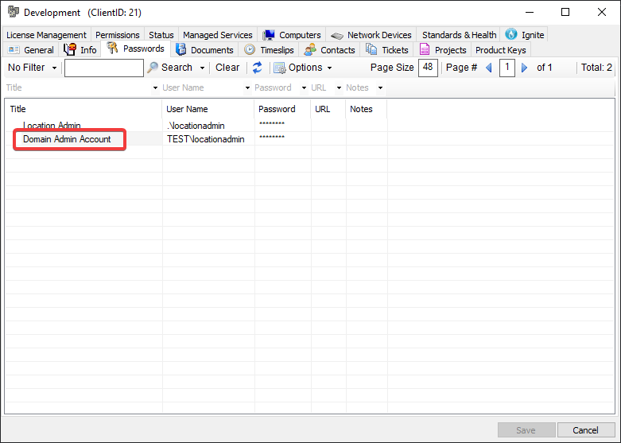
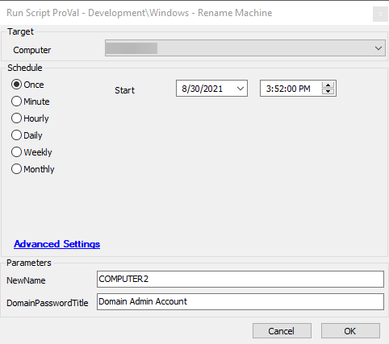

## Summary

This document describes how to rename a Windows machine.

**Time Saved by Automation:** 5 Minutes

## Sample Run





## Dependencies

- [Rename-Machine](https://proval.itglue.com/DOC-5078775-8175161)

## Variables

- `@Username@` - The username gathered from the passwords table.
- `@Password@` - The password gathered from the passwords table.

### User Parameters

| Name                | Example             | Required | Description                                                                                                                                                       |
|---------------------|---------------------|----------|-------------------------------------------------------------------------------------------------------------------------------------------------------------------|
| NewName             | COMPUTER2           | True     | The new name to set on the target machine.                                                                                                                     |
| DomainPasswordTitle | Domain Admin Account | False    | The title of the password entry to use for the username and password for domain authentication. The password entry must be under the same client as the target machine. |

## Process

See the [Rename-Machine](https://proval.itglue.com/DOC-5078775-8175161) document for detailed information about the backend process.

## Output

Outputs logs to the standard output location:

```
./Rename-Machine-log.txt
```

If the script is successful, the following file will contain output:

```
./Rename-Machine-data.txt
```

If there are errors during the execution of the script, an error file will be generated:

```
./Rename-Machine-error.txt
```

