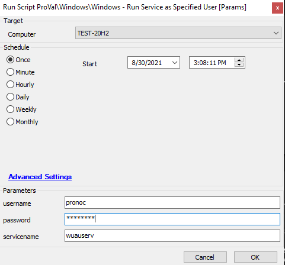

## Summary

This script will start a specified service with a specific user account. It works for both domain and local user accounts.

**Time Saved by Automation:** 10 Minutes

## Sample Run

#### User Parameters

| Name        | Example   | Required | Description                                                             |
|-------------|-----------|----------|-------------------------------------------------------------------------|
| username    | pronoc    | True     | The username whose authentication is required to run the service        |
| password    | ********* | True     | The password to authenticate to run the service                          |
| servicename | wuauserv  | True     | The service that is required to run with the provided user credentials   |

## Process

This script will start a specified service with a specific user account. It works for both domain and local user accounts. The script will also attempt to restart the service after the logon account change and verify the result accordingly.

## Output

- Script log

