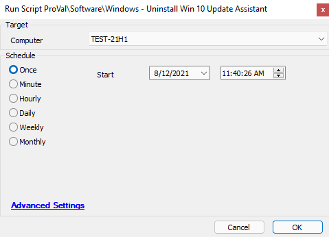

## Summary

This script will attempt to remove the Windows 10 Upgrade Assistant application from the target machine.

Time Saved by Automation: 5 Minutes

## Sample Run

## Dependencies

The target device must be a Windows operating system. It also must have the Windows 10 Upgrade Assistant installed.

## Variables

None

## Process

The script will first check and see if the Windows 10 Upgrade Assistant is installed; if it is not, the script will go to the Else section of the script and exit successfully. If the software is detected, the script will proceed to the Then section. The script will look for the Windows10UpgraderApp.exe file; if this file is missing, the script will exit with an error. If the script detects the above file, it will run a command to uninstall the software and will place the output from the command into the script log messages. The script will update the software inventory and verify that the software was uninstalled. If the script removed the software, it will exit successfully with a log message. If the script did not remove the software, it will exit on error.

## Output

- Script log messages only

