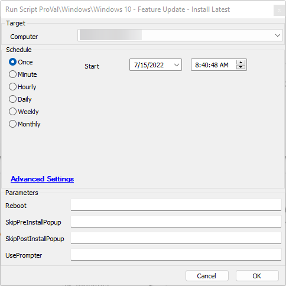
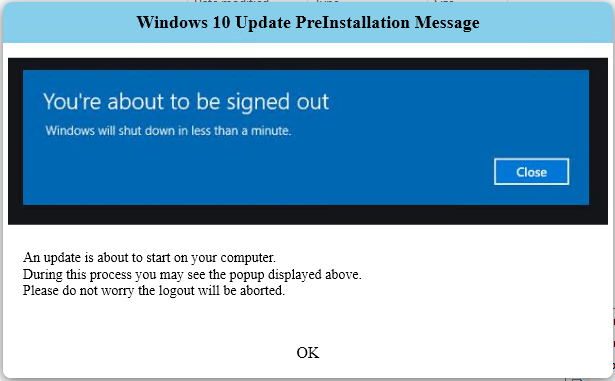
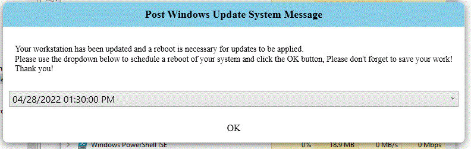

## Summary

Install the latest Feature Update to Windows 10 with optional popup messages, displayed from either User Prompt-show or Prompter for the user pre and post installation, as well as initiating the reporting feature of this solution.

## Sample Run

## Running As An Autofix

1. Please be careful with scheduling this as an autofix action. By default, the autofix action will set the parameters as follows:
   - Reboot = Auto
   - SkipPreInstallPopup = Yes
   - SkipPostInstallPopup = Yes

This means the script will automatically reboot itself upon completion with no pop-up prompts. Please schedule the autofix actions at an appropriate time.

## Dependencies

- [SEC - Windows Patching - Agnostic - Update-Windows10](/docs/7fdd2a3b-2dca-43db-8a1d-f350967f1055)
  - [Document](https://app.myglue.com/help_center/documents/9447713)
- [CWM - Automate - Custom Table - plugin_proval_windows10_upgradestats](/docs/75c18bf0-9ebc-43c7-a5a3-03510d131af5)
  - [Document](https://app.myglue.com/help_center/documents/9746809)
- [EPM - Agnostic - Prompt-User](https://proval.itglue.com/DOC-5078775-9580402)
  - [Document](https://app.myglue.com/help_center/documents/9580402)
- [EPM - Data Collection - Script - User-Show-PromptMessage](/docs/d4406d51-fc3a-46e1-8e25-31a5f43b05e2)
  - [Document](https://app.myglue.com/help_center/documents/9739032)
- [CWM - Automate - Script - Prompter](/docs/d8a124df-ea81-4194-82fc-a082c7a036d8)
- [Prompter](/docs/d8a124df-ea81-4194-82fc-a082c7a036d8)
- [EPM - Data Collection - Script - Windows 10 Update Stats - Retrieve](/docs/65815475-a61d-4f0d-b2ba-c7b8368285c9)

## Variables

Document the various variables in the script. Delete any section that is not relevant to your script.

| Name                   | Description                                                                                                      |
|------------------------|------------------------------------------------------------------------------------------------------------------|
| GroupID                | Holds the ID of the group created to hold machines receiving this script (Windows10 Upgrade Pending Reports).   |
| RetrieveScriptID       | Holds the scriptID for the report information gathering script.                                                |
| ATName                 | Holds the name of the alert template to be created.                                                            |
| ATComment              | Holds the comment to be assigned to the alert template.                                                        |
| ATGUID                 | Holds the GUID for the alert template that will be created.                                                    |
| AlertActionID          | Holds the alert action identifier for later use.                                                               |
| LogName                | Holds the event log name, used for reporting.                                                                  |
| EventID                | Holds the event ID of the created event for reporting.                                                         |
| ProviderName           | Holds the provider name created by the script for the event log, used for reporting.                           |
| Type                   | Holds the message type for the pop-up message used in this script.                                            |
| Message                | Holds the message text for the pop-up message used in this script.                                            |
| Title                  | Holds the title of the pop-up message displayed in this script.                                               |
| ButtonType             | Holds the button type set in the pop-up message displayed with this script.                                   |
| Timeout                | Holds the timeout in seconds that the pop-up is displayed before exiting automatically.                        |
| Theme                  | Holds the desired theme for the pop-up message displayed with this script.                                     |
| AddImage               | Holds the URL link to the web-hosted image we intend on displaying for the pre-installation pop-up.           |
| Reboot                 | Holds the type of reboot selected, None or Auto.                                                               |
| AddDateTimeSelection    | Tells the pop-up creation script that we are adding a date time selection to the message.                     |
| IncrementMinutes       | This holds the increment minutes between each selectable option in the date time selection on the pop-up.      |
| DurationDays           | This holds the amount of days the date time selection will span for its options.                               |
| TimeToReboot           | Holds the received value for the date and time the user selected in the pop-up.                               |

## Global Parameters

| Name            | Description                                                                                   |
|-----------------|-----------------------------------------------------------------------------------------------|
| TicketOnError   | If set to 1, ticketing on error will be turned on.                                          |

### User Parameters

| Name                   | Example | Required | Description                                                                                                                                                                                                                       |
|------------------------|---------|----------|-----------------------------------------------------------------------------------------------------------------------------------------------------------------------------------------------------------------------------------|
| Reboot                 | None    | No       | This parameter determines if the standard automated reboot from the Windows 10 Upgrade Assistant will occur. To suppress the reboot, please enter "None". For an immediate reboot, please enter "Auto". If the parameter field is blank when the script is scheduled, the script will proceed with the "Auto" option that will allow a forced reboot of the device. Please use caution when running this script during business hours! |
| SkipPreInstallPopup    | Yes     | No       | This script will notify the end-user that the upgrade process has begun. If you would like to skip this prompt, please enter "Yes". If anything other than "Yes" is entered into the parameter box, the end-user will receive the popup notification. |
| SkipPostInstallPopup   | No      | No       | This script will notify the end-user that the upgrade process has been completed and their machine requires a reboot. The user will receive a popup with a time selection utility that will allow them to select a convenient reboot time. If you would like to skip this prompt, please enter "Yes". If anything other than "Yes" is entered into the parameter box, the end-user will receive the popup notification. |
| UsePrompter            | Yes     | No       | This option toggles the method of displaying the pre and post pop-up message from using User Prompt-Show to Prompter.                                                                                                                                                       |

## Screenshots

## Process

1. Start the monitor creation process.
2. Check if the group (Windows10 Upgrade Pending Reports) exists; if not, create it.
3. Grab the group ID from the system.
4. Check to see if the autofix action (~ Autofix - Windows10 Update Stats - Retrieve) exists; if not, create it.
5. Check to see if an alert template exists for the autofix action; if not, create it.
6. Create the monitor on that group to monitor for event 6501 in the application logs, with a provider of "Update-Windows10-PS" if it does not already exist.
7. Add the alert action to the remote monitor created.
8. Check the Reboot variable to ensure it has a proper parameter.
9. Determine if the pre-installation message is being skipped; if not, display the pre-installed message by calling User-Show-PromptMessage or Prompter depending on provided parameter values.
10. Set the download and running variables.
11. Download the file.
12. Start the agnostic script.
13. Verify the script run; if errored, exit with error and ticket if the global variable is set.
14. Check if the machine is in that group. If not, add it.
15. Check for skipped post-install message; if yes, exit here.
16. Prompt the post-installation pop-up.
17. Save the selected time to variable; if blank, exit here.
18. Convert the difference in time between current and selected time to seconds and execute a shutdown /r /t [that amount of seconds].

## Output

- Script log

