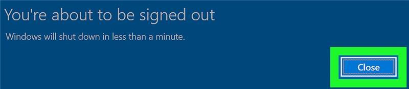
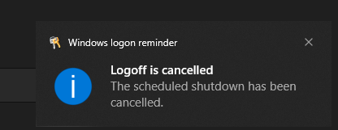
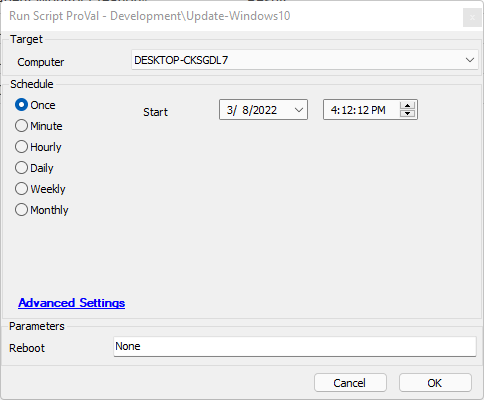

## Summary

Updates Windows 10 to the latest release with the option to either prompt the user to Reboot (Prompt) or abort the reboot altogether (None).

### *** IMPORTANT NOTES ***

### If aborting the reboot, and a user is logged in the user will see the following
1. A blue box saying the computer will reboot will pop up with a close button, it will last about 5 seconds and vanish.

2. After the blue box vanishes a black notification may appear in the lower right-hand side of the screen saying a user logout was aborted.

### ***IMPORTANT FUNCTIONALITY NOTE***
If aborting the reboot, between the time that a user sees the blue banner and the time the computer is restarted **any change made to the C:/windows directory and its subfolders will be LOST after rebooting.**

### ****RUNNING AS AUTOFIX NOTE ****
**If you are running this as an autofix the reboot parameter WILL DEFAULT TO PROMPT.**

**This Means it will reboot.**

## Sample Run

## Dependencies

- [SEC - WindowsPatching - Agnostic - Update-Windows10](<../../powershell/Update-Windows10.md>)

### User Parameters

| Name    | Example        | Required | Description                                                                                      |
|---------|----------------|----------|--------------------------------------------------------------------------------------------------|
| Reboot  | None / Prompt  | True     | A Reboot value of None aborts the reboot, a value of Prompt will prompt the user.              |

## Process

Please review the document at [SEC - WindowsPatching - Agnostic - Update-Windows10](<../../powershell/Update-Windows10.md>).

## Output

- Script log

