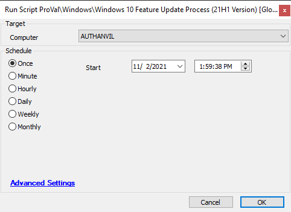

## Summary

This process is used to upgrade a Windows operating system to a specific Feature Update version of Windows 10.

## Sample Run



## Dependencies

A minimum of 20GB of free space on the target system is required.

The following operating systems have confirmed support for this process:

- Windows 7 Pro x64
- Windows 8 Pro x64
- Windows 8.1 Pro x64
- Windows 10 Home x64 (All Feature Update Versions)
- Windows 10 Pro x64 (All Feature Update Versions)
- Windows 10 Business x64 (All Feature Update Versions)

The payload of this script is a ZIP file that contains the contents of the ISO for the target Feature Update. This ZIP file must be hosted by the MSP on a publicly accessible web server. If you would like to validate that your provided URL will work properly with this process, please run the following PowerShell script on a test machine and view the results, replacing the `$zipURL` string with your 1909 URL:

```powershell
$zipURL = "https://your.url.here/path/to/file/1909.zip"
[byte[]]$targetHash = "146,151,139,92,58,82,93,198,226,27,177,213,41,217,199,194" -split ','
[Net.ServicePointManager]::SecurityProtocol = [Enum]::ToObject([Net.SecurityProtocolType], 3072)
$dir = "C:\\temp"
$zip = "$($dir)\\1909.zip"
mkdir -Path $dir -ErrorAction SilentlyContinue
$webClient = New-Object System.Net.WebClient
$webClient.DownloadFile($zipURL, $zip)
if (-not $(Test-Path -Path $zip)) {
    Write-Host "ERROR: Unable to download zip file. Please ensure that there is nothing blocking the ZIP URL and that the URL in the script is still valid."
    return
} else {
    $md5 = [System.Security.Cryptography.MD5]::Create()
    $fileStream = [System.IO.File]::OpenRead($zip)
    $hash = $md5.ComputeHash($fileStream)
    $fileStream.Close()
    if ([System.Linq.Enumerable]::SequenceEqual($hash, $targetHash)) {
        Write-Host "Hashes match. Download complete."
    } else {
        Write-Host "ERROR: Hashes do not match. Download failed."
        Remove-Item -Path $zip -ErrorAction SilentlyContinue
    }
}
```
*Figure 1: PowerShell script for testing 1909 ZIP download*

```powershell
$zipURL = "https://your.url.here/path/to/file/2004.zip"
[byte[]]$targetHash = "50,89,227,156,100,0,144,217,240,87,169,198,11,8,195,245" -split ','
[Net.ServicePointManager]::SecurityProtocol = [Enum]::ToObject([Net.SecurityProtocolType], 3072)
$dir = "C:\\temp"
$zip = "$($dir)\\2004.zip"
mkdir -Path $dir -ErrorAction SilentlyContinue
$webClient = New-Object System.Net.WebClient
$webClient.DownloadFile($zipURL, $zip)
if (-not $(Test-Path -Path $zip)) {
    Write-Host "ERROR: Unable to download zip file. Please ensure that there is nothing blocking the ZIP URL and that the URL in the script is still valid."
    return
} else {
    $md5 = [System.Security.Cryptography.MD5]::Create()
    $fileStream = [System.IO.File]::OpenRead($zip)
    $hash = $md5.ComputeHash($fileStream)
    $fileStream.Close()
    if ([System.Linq.Enumerable]::SequenceEqual($hash, $targetHash)) {
        Write-Host "Hashes match. Download complete."
    } else {
        Write-Host "ERROR: Hashes do not match. Download failed."
        Remove-Item -Path $zip -ErrorAction SilentlyContinue
    }
}
```
*Figure 2: PowerShell script for testing 2004 ZIP download*

Links to download the ZIP files for the MSP to host will be provided by ProVal. Note that utilizing any ZIP file other than the one provided by ProVal or modifying the ZIP file in any way will cause the process to fail, as there are MD5 checks in place for validation of proper downloading by the client machines.

A stable internet connection on client machines is required.

This process will fail if the target machine does not have a United States version of Windows installed. If you would like to use a ZIP targeted at a different country install of Windows 10, please contact ProVal support so that we can generate the separate ZIP file and MD5 hash to use in this case. Do not modify the existing script.

## Global Parameters

| Name                     | Example                                              | Required | Description                                                                                     |
|--------------------------|------------------------------------------------------|----------|-------------------------------------------------------------------------------------------------|
| tempdir                  | C:/temp                                             | True     | The temporary directory to download and extract files to.                                     |
| ZIPURL                   | [https://file.provaltech.com/zips/21H1.zip](https://file.provaltech.com/zips/21H1.zip) | True     | The URL to the target ZIP payload.                                                             |
| HoursToWait              | 1                                                    | True     | The maximum number of hours to wait for the update to complete.                               |
| TargetHash               | 17,168,89,196,67,52,23,188,144,143,158,145,94,203,64,70 | True     | The known good MD5 hash of the target ZIP payload.                                            |
| ftpusername              | ftpuser                                             | False    | The username to authenticate with an FTP server.                                              |
| ftppassword              | p@ssW0rd1!                                         | True     | The password to authenticate with an FTP server.                                              |
| TargetVersion            | 2104                                               | True     | The version that the script should target to update. Note that this should only be changed by ProVal upon a new Feature Update release. |
| TicketingEnabled         | 1                                                    | False    | Set this to 1 to create tickets on success/failure of the script.                             |
| TicketCreationCategory    | 121                                               | False    | The ID of the ticket category to use for ticketing.                                          |

## Process

The step-by-step process of this script is as follows:

1. The script will validate that the target machine is eligible for the upgrade. Ineligibility is determined by the ReleaseID (1809, 1903, 1909…) of the target.
2. A disk space check is performed. If less than 20GB, the script exits on error.
3. The download process begins.
   1. A check is performed to confirm if the ZIP file already exists on the target machine. This is done through MD5 hash validation. If it exists, then the download is skipped.
   2. The ZIP file download is attempted.
   3. If the file is not found after the download is completed, an error is thrown, and the download portion exits.
   4. If the file is found, an MD5 hash validation is performed. If the file fails the validation, an error is thrown, the malformed file is deleted, and the script exits.
4. The ZIP file is extracted to a directory of the same name.
   - i.e. C:/temp/1909.zip is extracted to C:/temp/1909
5. If setup.exe is not found in the extracted directory, the script will exit on error.
6. The upgrade is started.
7. The script will then wait the specified number of hours in the HoursToWait parameter, in 15-minute increments. (i.e. if HoursToWait is 2, then the update will check for success 8 times every 15 minutes before failing)
8. If the update is found to be successful, the script notes this in the script log and exits.
9. If the HoursToWait is exceeded and the update is not complete, the script will attempt to gather logs by downloading SetupDiag.exe from Microsoft and write these to the script log for further troubleshooting.

## Output

- Script log

## ZIP File Links

- [1909.zip](http://1909.zip) - [https://provaltech.sharepoint.com/:u:/s/ExternalSharing/EVC5VtfuJO5Eh0nydBm6D3IBgNSnUMN5GP-BlNeIiR3eTQ?e=7AZiLj](https://provaltech.sharepoint.com/:u:/s/ExternalSharing/EVC5VtfuJO5Eh0nydBm6D3IBgNSnUMN5GP-BlNeIiR3eTQ?e=7AZiLj)
- [2004.zip](http://2004.zip) - [https://provaltech.sharepoint.com/:u:/s/ExternalSharing/EeVJgf_xBEtHhm887oW_5tEBPpJK6T-D_B7YgzfCOQscRw?e=L2vipg](https://provaltech.sharepoint.com/:u:/s/ExternalSharing/EeVJgf_xBEtHhm887oW_5tEBPpJK6T-D_B7YgzfCOQscRw?e=L2vipg)
- [20H2.zip](http://20h2.zip) - [https://provaltech.sharepoint.com/:u:/s/ExternalSharing/EbMyVIcPKtJCqbVIwbfIt-IBFuQtQzB7CwW8fvEe5JjYqA?e=UvtbeX](https://provaltech.sharepoint.com/:u:/s/ExternalSharing/EbMyVIcPKtJCqbVIwbfIt-IBFuQtQzB7CwW8fvEe5JjYqA?e=UvtbeX)
- [21H1.zip](http://21h1.zip) - [https://provaltech.sharepoint.com/:u:/s/ExternalSharing/EQwntQayWExMnWedp23IvMkBCO3atIif5KldmRO4_vIVag?e=XGUQ8T](https://provaltech.sharepoint.com/:u:/s/ExternalSharing/EQwntQayWExMnWedp23IvMkBCO3atIif5KldmRO4_vIVag?e=XGUQ8T)

## Hash Creation Process

```powershell
$zip = "C:\\path\\to\\zipfile.zip"
$md5 = [System.Security.Cryptography.MD5]::Create()
$fileStream = [System.IO.File]::OpenRead($zip)
$hash = $md5.ComputeHash($fileStream)
$hash -join ','
```


