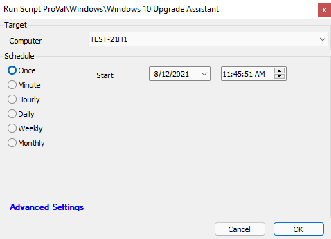

## Summary

This script will attempt to download, install, and run the Windows 10 Upgrade Assistant Application. This script will attempt to upgrade the target device to the most recent version of Windows 10.

Time Saved by Automation: 120 Minutes

## Sample Run

## Dependencies

The target machine must be a Windows-based machine. This script may upgrade eligible machines running older Windows operating systems, like Windows 7.

## Variables

`@PSout@` - The result from downloading and running the PowerShell script built into this script.

## Process

The script will execute a PowerShell script that will download, install, and run the Windows 10 Upgrade Assistant. The script will output the results from the start of the application to the `@psout@` variable.

The script will then sleep for 2 minutes and then check to see if the `Windows10UpgraderApp` process is running. The upgrade process can take several hours depending on the age of the device being updated. (The older the version of Windows, the longer this script may take as it downloads the requirements for the latest build of Windows.)

If the process for the Windows 10 app exists, the script will exit successfully as the machine has begun the process to upgrade the device. If the process is not running the script will exit with an error indicating that the script failed to start the process and to review the device to ensure it is eligible to be upgraded.

## Output

- Script log messages only

