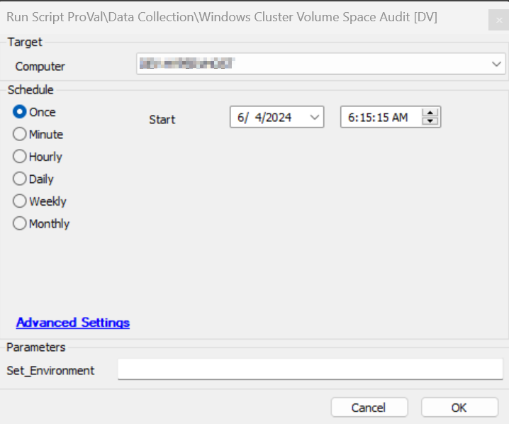
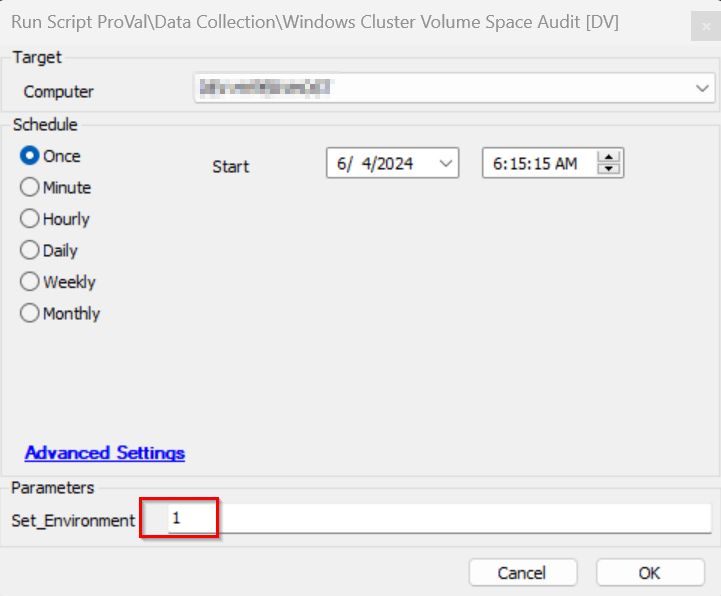

## Summary

This script is designed to perform an audit of the cluster group devices to maintain a report of the free space on the cluster disks.

## Sample Run

Set the value of `Set_Environment` to 1 to create the table and schedule the script every Monday at 4:30 AM agent time on the "_System Automation/Cluster Detected" group.

## Dependencies

[CWA Script - Windows Cluster Shared Volume](<./Windows Cluster Shared Volume Autofix,Ticket.md>)

#### Global Parameters

| Name      | Example              | Required | Description                                                                 |
|-----------|----------------------|----------|-----------------------------------------------------------------------------|
| TableName | pvl_cluster_volumes   | True     | This table stores the audit report of the cluster disks of the cluster servers. |

## User Parameters

| Name            | Example | Required | Description                                                                                                         |
|-----------------|---------|----------|---------------------------------------------------------------------------------------------------------------------|
| Set_Environment  | 1       | False    | Set to 1 to create the table and schedule the script every Monday at 4:30 AM agent time on the "_System Automation/Cluster Detected" group. |

## Output

- Script log
- Dataview

