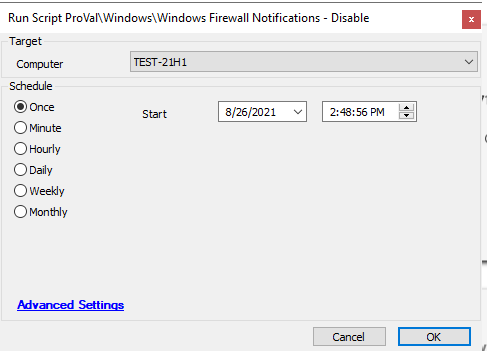

## Summary

This script will disable the firewall notifications for all users on a Windows system.

**Time Saved by Automation:** 15 Minutes

## Sample Run

## Process

- This script will run a PowerShell script to disable the firewall notifications on a Windows system.
- It will check the output of the PowerShell script; if there is no error, it will exit. Otherwise, it will check for Windows 10 machines.
- If a Windows 10 machine is found, it will run a new PowerShell script on the machine to disable the firewall notifications for all users.

## Output

- Script logs

