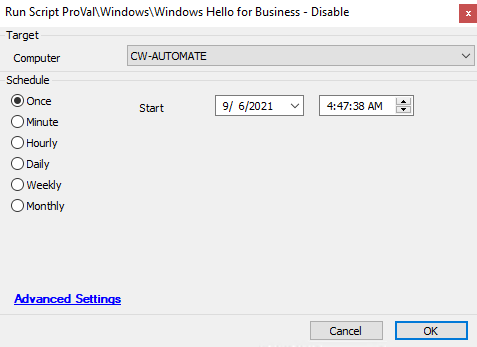

## Summary

This script disables Windows Hello for Business.  
**Time Saved by Automation:** 10 Minutes  

## Sample Run

  

## Process

This script disables Windows Hello for Business by adding the registry key `HKLM:/SOFTWARE/Policies/Microsoft/PassportForWork:Enabled` and setting its value to `0`.  

## Output

- Script log  

