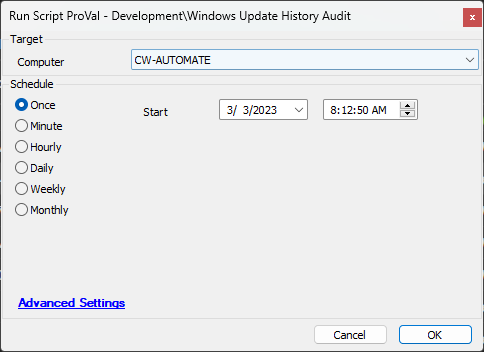

## Summary

This document describes a script that gathers Windows update data and enters it into the [EPM - Custom Table - pvl_windows_updates](<../tables/pvl_windows_updates.md>) table.

## Sample Run

## Dependencies

- [EPM - Data Collection - Get-WindowsUpdateReport](<../../powershell/Get-WindowsUpdateReport.md>)

## Variables

| Name      | Description                                         |
|-----------|-----------------------------------------------------|
| JSONPath  | The file path where the serialized object will be saved. |

#### Global Parameters

| Name        | Value                 | Description                                   |
|-------------|-----------------------|-----------------------------------------------|
| TableName   | pvl_windows_updates    | The table to save the data to.               |
| ProjectName | Get-WindowsUpdateReport | The name of the target agnostic script.      |

## Output

- Script Log
- [pvl_windows_updates](<../tables/pvl_windows_updates.md>)

