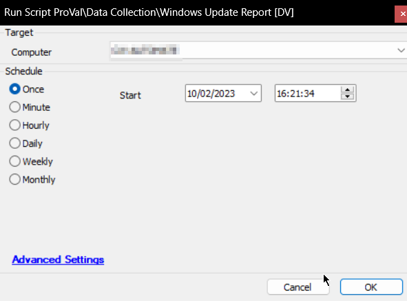

## Summary

Get a detailed list of patches that are installed or available on the local machine and store it in the [plugin_proval_windows_update_report](https://proval.itglue.com/5078775/docs/10861700) custom table.

## Sample Run

## Dependencies

- [EPM - Data Collection - Get-WindowsUpdateReport](/docs/b5940a1c-0e82-4756-86a2-b49e57d664f1)
- [CWM - Automate - Solution - Windows Update Report](/docs/affc0b47-f0fe-43f9-95f6-0e0d1205b4d6)
- [CWM - Automate - Dataview - Windows Update Report [Script]](/docs/88f63da5-1a24-4545-b322-f6a3dfbc79cf)
- [CWM - Automate - Custom Table - plugin_proval_windows_update_report](/docs/845fe569-12ec-48e3-86f4-34377aba03ec)
- [CWM - Automate - Script - OverFlowedVariable - SQL Insert - Execute](/docs/34cee8fe-1b6b-4558-a890-2face427ceb8)

## Variables

| Name            | Description                                                                                     |
|-----------------|-------------------------------------------------------------------------------------------------|
| InsertStatement  | Result of the PowerShell script that attempts to retrieve the Windows Update Report            |

## Process

1. Creating the [plugin_proval_windows_update_report](https://proval.itglue.com/5078775/docs/10861700) table if it does not already exist.
2. Changing the structure of the table if the partner is still using the older structure. This step also removes duplicate entries from the table.
3. Running the PowerShell script to retrieve the Windows Update Report.
4. Verifying the outcome.
5. Parsing the outcome to ensure SQL compatibility.
6. Inserting the data into the [plugin_proval_windows_update_report](https://proval.itglue.com/5078775/docs/10861700) table.
7. Logging any failures.

## Output

- Script Log
- Custom Table
- Dataview

