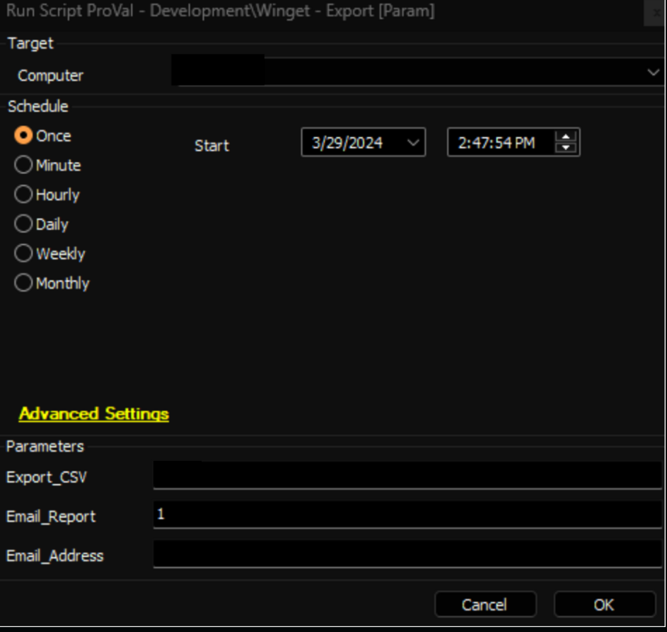
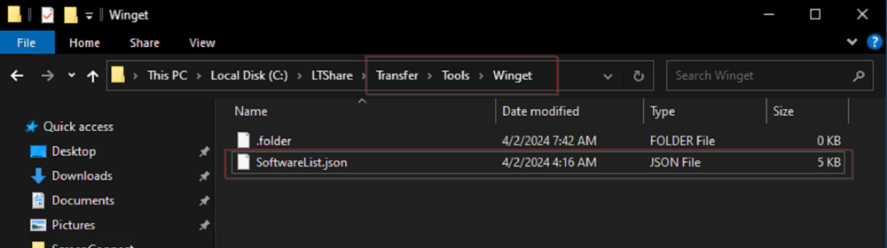
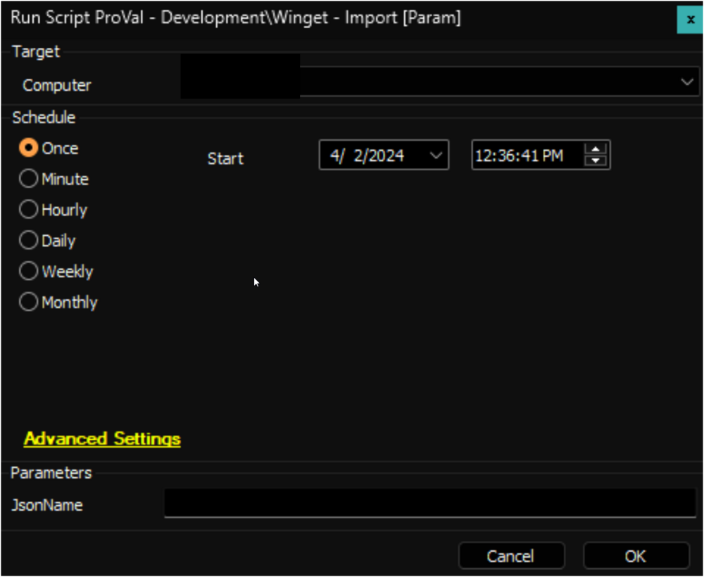
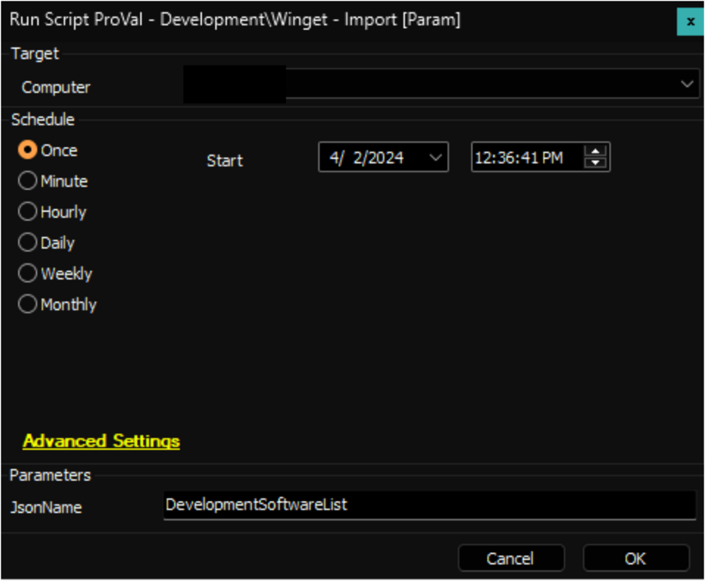
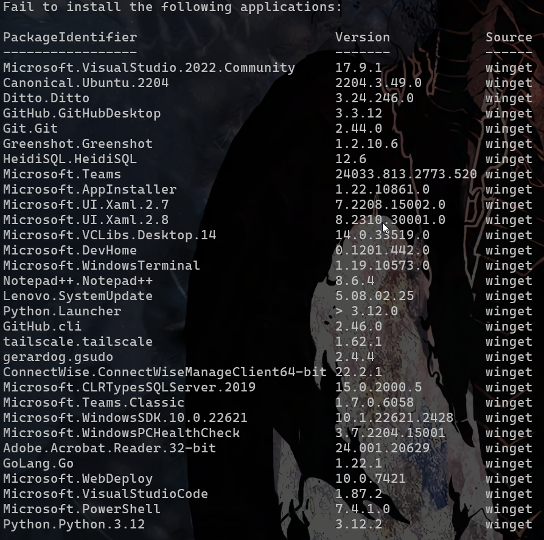

## Summary

The script offers the functionality to install a list of applications using winget from the `softwarelist.json` file exported by the [SWM - Data Collection - Script - Winget - Export [Param]](<./Winget - Export Param.md>) script.

Additionally, it includes an option to create a ticket with the list of applications that failed to deploy on the computer from the `softwarelist.json` list.

**Requirements:** PowerShell 5+

## Implementation

1. Import the following scripts from the `ProSync` plugin:  
   - [Winget - Export [Param]](<./Winget - Export Param.md>)  
   - [Winget - Import [Param]](https://proval.itglue.com/5078775/docs/15522130)  

2. Run the [Winget - Export [Param]](<./Winget - Export Param.md>) on the preferred computer to export the list of installed applications. Ensure to set the parameter `Email_Report` to `1`. This will send the list of installed applications to your email address, saved as `SoftwareList.Json`.

   

3. Place the `SoftwareList.json` file in LTShare (WebDav for the hosted partners) under the `Transfer/Tools/Winget` directory. Create the `Winget` directory if it's missing.

   

4. To enable the creation of failure tickets from the script, create a system property named `TicketCreationCategory_Winget_Import` in Automate. Assign the ID of the ticket category you want to use for creating these tickets.

## Sample Run

After placing the software list as `softwarelist.json` in LTShare at the path explained in the `Implementation` section of the document:

The name of the file without the extension should be set to the user parameter after placing the software list with a different name in LTShare at the path explained in the `Implementation` section of the document:

## Dependencies

[SWM - Data Collection - Script - Winget - Export [Param]](<./Winget - Export Param.md>)

### User Parameters

| Name         | Example                 | Required | Description                                                                                                                                                                                                                      |
|--------------|-------------------------|----------|----------------------------------------------------------------------------------------------------------------------------------------------------------------------------------------------------------------------------------|
| JsonName     | DevelopmentSoftwareList  | False    | The name of the file without the extension should be set to the user parameter after placing the software list with a different name in LTShare at the path explained in the `Implementation` section of the document.          |

### System Properties

| Name                                   | Example | Required | Description                                                                                                                                                                                                                      |
|----------------------------------------|---------|----------|----------------------------------------------------------------------------------------------------------------------------------------------------------------------------------------------------------------------------------|
| TicketCreationCategory_Winget_Import   | 6       | False    | ID of the ticket category to create a ticket. Setting the ID of the relevant ticket category in this system property will enable ticketing on failure for the script. The script will not create a ticket if this property is missing or set to 0. |

## Output

- Script log
- Ticket (if enabled)

## Ticketing

**Subject:** `Winget Import - Software List - Failed - %ComputerName%`

**Summary:**  
`Failed to install the following applications:`  
`\\<List of the failed applications>`

**Example:**  

