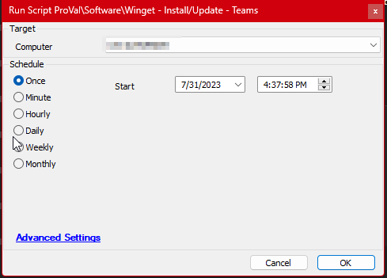

## Summary

An implementation of [SWM - Software Installation - Script - Winget - Install/Update](https://proval.itglue.com/DOC-5078775-11956636) script to deploy `Teams Machine-Wide Installer` application only.

## Sample Run

#### Global Parameters

| Name        | Value               |
|-------------|---------------------|
| ProjectName | Invoke-Webrequest    |
| PackageID   | Microsoft.Teams      |
| Source      | Winget               |

## Output

- Script Logs

