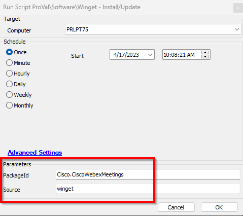

## Summary

This document explains how to install a Winget package on a target endpoint.

## Sample Run

## Dependencies

- [SWM - Software Management - Powershell - Invoke-WingetProcessor](<../../powershell/Invoke-WingetProcessor.md>)

### Global Parameters

| Name        | Example                | Required | Description                                                                 |
|-------------|------------------------|----------|-----------------------------------------------------------------------------|
| ProjectName | Invoke-WingetProcessor | True     | This represents the name of the Agnostic script and should not be changed. |

### User Parameters

| Name      | Example                          | Required | Description                                |
|-----------|----------------------------------|----------|--------------------------------------------|
| PackageId | Cisco.CiscoWebexMeetings        | True     | The Winget package you wish to install.   |
| Scope     | msstorewinget                   | True     | The source to use when obtaining the package. |

## Process

Please refer to [SWM - Software Management - Powershell - Invoke-WingetProcessor](<../../powershell/Invoke-WingetProcessor.md>) for the process.

## Output

- Script log

