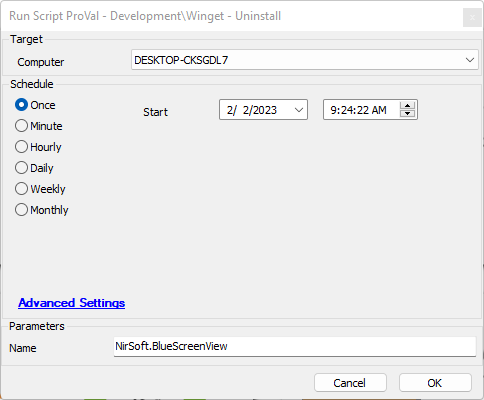

## Summary

This script will remove a Winget package.

## Sample Run

## Dependencies

- [SWM - Software Management - Powershell - Invoke-WingetProcessor](<../../powershell/Invoke-WingetProcessor.md>)

#### Global Parameters

| Name         | Example                  | Required | Description                                                                                       |
|--------------|--------------------------|----------|---------------------------------------------------------------------------------------------------|
| ProjectName  | Invoke-WingetProcessor    | True     | This variable must remain Invoke-WingetProcessor it represents the agnostic script name without the .ps1 |

#### User Parameters

| Name | Example                  | Required | Description                      |
|------|--------------------------|----------|----------------------------------|
| Name | Nirsoft.BlueScreenView   | True     | The Winget Package to remove.    |

## Process

Please reference the Agnostic Documentation for process.

## Output

- Script log

