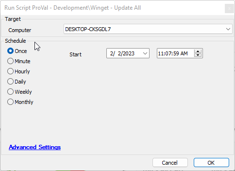

## Summary

This script will update all Winget packages found on an endpoint.

## Sample Run

## Dependencies

- [SWM - Software Management - PowerShell - Invoke-WingetProcessor](<../../powershell/Invoke-WingetProcessor.md>)

### Global Parameters

| Name          | Example                   | Required | Description                                                                                     |
|---------------|---------------------------|----------|-------------------------------------------------------------------------------------------------|
| ProjectName   | Invoke-WingetProcessor    | True     | This references the Agnostic Script name without the .ps1 and should not be changed.           |

## Process

Please reference the agnostic content for the process.

## Output

- Script log

